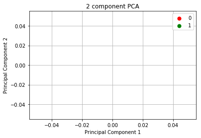
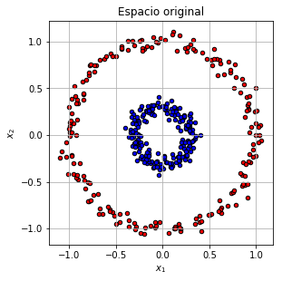
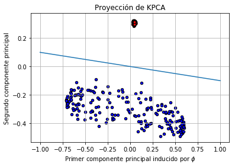

```python
import pandas as pd
import matplotlib.pyplot as plt
import numpy as np

from sklearn.decomposition import PCA, KernelPCA
from sklearn.datasets import make_circles
```


```python
path='valores.csv'
all_variables=['Edad','Juega','Id','Horas_Diarias']
features=['Edad','Juega','Id','Horas_Diarias']
target=['Edad']
df= pd.read_csv(path,names=all_variables)
df.head()
```


<div>
<style scoped>
    .dataframe tbody tr th:only-of-type {
        vertical-align: middle;
    }

    .dataframe tbody tr th {
        vertical-align: top;
    }

    .dataframe thead th {
        text-align: right;
    }
</style>
<table border="1" class="dataframe">
  <thead>
    <tr style="text-align: right;">
      <th></th>
      <th>Edad</th>
      <th>Juega</th>
      <th>Id</th>
      <th>Horas_Diarias</th>
    </tr>
  </thead>
  <tbody>
    <tr>
      <th>0</th>
      <td>16</td>
      <td>0</td>
      <td>437265</td>
      <td>3</td>
    </tr>
    <tr>
      <th>1</th>
      <td>22</td>
      <td>0</td>
      <td>960278</td>
      <td>6</td>
    </tr>
    <tr>
      <th>2</th>
      <td>13</td>
      <td>1</td>
      <td>266983</td>
      <td>2</td>
    </tr>
    <tr>
      <th>3</th>
      <td>13</td>
      <td>0</td>
      <td>784322</td>
      <td>2</td>
    </tr>
    <tr>
      <th>4</th>
      <td>17</td>
      <td>1</td>
      <td>451604</td>
      <td>2</td>
    </tr>
  </tbody>
</table>
</div>


```python
from sklearn.preprocessing import MinMaxScaler
scaler = MinMaxScaler()
df_sc = pd.DataFrame(scaler.fit_transform(df[features]),columns=features)
df_sc.head()
```

    /home/raul/dev/anaconda3/lib/python3.7/site-packages/sklearn/preprocessing/data.py:334: DataConversionWarning: Data with input dtype int64 were all converted to float64 by MinMaxScaler.
      return self.partial_fit(X, y)


<div>
<style scoped>
    .dataframe tbody tr th:only-of-type {
        vertical-align: middle;
    }

    .dataframe tbody tr th {
        vertical-align: top;
    }

    .dataframe thead th {
        text-align: right;
    }
</style>
<table border="1" class="dataframe">
  <thead>
    <tr style="text-align: right;">
      <th></th>
      <th>Edad</th>
      <th>Juega</th>
      <th>Id</th>
      <th>Horas_Diarias</th>
    </tr>
  </thead>
  <tbody>
    <tr>
      <th>0</th>
      <td>0.500000</td>
      <td>0.0</td>
      <td>0.376162</td>
      <td>0.4</td>
    </tr>
    <tr>
      <th>1</th>
      <td>1.000000</td>
      <td>0.0</td>
      <td>0.961547</td>
      <td>1.0</td>
    </tr>
    <tr>
      <th>2</th>
      <td>0.250000</td>
      <td>1.0</td>
      <td>0.185573</td>
      <td>0.2</td>
    </tr>
    <tr>
      <th>3</th>
      <td>0.250000</td>
      <td>0.0</td>
      <td>0.764607</td>
      <td>0.2</td>
    </tr>
    <tr>
      <th>4</th>
      <td>0.583333</td>
      <td>1.0</td>
      <td>0.392211</td>
      <td>0.2</td>
    </tr>
  </tbody>
</table>
</div>


```python
pca = PCA()
df_pca = pd.DataFrame(pca.fit_transform(df[features]),columns=features)
df_pca.head()
```


<div>
<style scoped>
    .dataframe tbody tr th:only-of-type {
        vertical-align: middle;
    }

    .dataframe tbody tr th {
        vertical-align: top;
    }

    .dataframe thead th {
        text-align: right;
    }
</style>
<table border="1" class="dataframe">
  <thead>
    <tr style="text-align: right;">
      <th></th>
      <th>Edad</th>
      <th>Juega</th>
      <th>Id</th>
      <th>Horas_Diarias</th>
    </tr>
  </thead>
  <tbody>
    <tr>
      <th>0</th>
      <td>120955.373736</td>
      <td>0.513591</td>
      <td>0.821232</td>
      <td>-0.498813</td>
    </tr>
    <tr>
      <th>1</th>
      <td>-402057.626274</td>
      <td>5.494898</td>
      <td>-2.280014</td>
      <td>-0.345856</td>
    </tr>
    <tr>
      <th>2</th>
      <td>291237.373742</td>
      <td>-2.152378</td>
      <td>1.853098</td>
      <td>0.453883</td>
    </tr>
    <tr>
      <th>3</th>
      <td>-226101.626257</td>
      <td>-3.281698</td>
      <td>1.456770</td>
      <td>-0.495258</td>
    </tr>
    <tr>
      <th>4</th>
      <td>106616.373733</td>
      <td>1.441934</td>
      <td>1.894163</td>
      <td>0.454885</td>
    </tr>
  </tbody>
</table>
</div>


```python
explained_variance = pca.explained_variance_ratio_
explained_variance
```


    array([1.00000000e+00, 1.93964062e-10, 4.03921846e-11, 3.43365263e-12])


```python
df_pca['target'] = df[target]
df_pca.columns = ['PC1', 'PC2','PC3','PC4','target']
df_pca.head()
```


<div>
<style scoped>
    .dataframe tbody tr th:only-of-type {
        vertical-align: middle;
    }

    .dataframe tbody tr th {
        vertical-align: top;
    }

    .dataframe thead th {
        text-align: right;
    }
</style>
<table border="1" class="dataframe">
  <thead>
    <tr style="text-align: right;">
      <th></th>
      <th>PC1</th>
      <th>PC2</th>
      <th>PC3</th>
      <th>PC4</th>
      <th>target</th>
    </tr>
  </thead>
  <tbody>
    <tr>
      <th>0</th>
      <td>16</td>
      <td>0.513591</td>
      <td>0.821232</td>
      <td>-0.498813</td>
      <td>16</td>
    </tr>
    <tr>
      <th>1</th>
      <td>22</td>
      <td>5.494898</td>
      <td>-2.280014</td>
      <td>-0.345856</td>
      <td>22</td>
    </tr>
    <tr>
      <th>2</th>
      <td>13</td>
      <td>-2.152378</td>
      <td>1.853098</td>
      <td>0.453883</td>
      <td>13</td>
    </tr>
    <tr>
      <th>3</th>
      <td>13</td>
      <td>-3.281698</td>
      <td>1.456770</td>
      <td>-0.495258</td>
      <td>13</td>
    </tr>
    <tr>
      <th>4</th>
      <td>17</td>
      <td>1.441934</td>
      <td>1.894163</td>
      <td>0.454885</td>
      <td>17</td>
    </tr>
  </tbody>
</table>
</div>


```python
fig = plt.figure()
ax = fig.add_subplot(1,1,1) 
ax.set_xlabel('Principal Component 1') 
ax.set_ylabel('Principal Component 2') 
ax.set_title('2 component PCA') 
targets = [0, 1]
colors = ['r', 'g']

for target, color in zip(targets,colors):
    indicesToKeep = df_pca['target'] == target
    ax.scatter(df_pca.loc[indicesToKeep, 'PC1']
    , df_pca.loc[indicesToKeep, 'PC2']
    , c = color
    , s = 50)
ax.legend(targets)
ax.grid()
```





```python
np.random.seed(0)
X, y = make_circles(n_samples=400, factor=.3, noise=.05)

plt.figure(figsize=(10,10))
plt.subplot(2, 2, 1, aspect='equal')
plt.title("Espacio original")
reds = y == 0
blues = y == 1

plt.scatter(X[reds, 0], X[reds, 1], c="red",s=20, edgecolor='k')
plt.scatter(X[blues, 0], X[blues, 1], c="blue",s=20, edgecolor='k')
plt.xlabel("$x_1$")
plt.ylabel("$x_2$")
plt.grid()
```





```python
kpca = KernelPCA(kernel = "rbf", fit_inverse_transform=True, gamma=10)
X_kpca = kpca.fit_transform(X)

pca = PCA()
X_pca = pca.fit_transform(X)

plt.scatter(X_kpca[reds, 0], X_kpca[reds, 1], c="red", s=20, edgecolor='k')
plt.scatter(X_kpca[blues, 0], X_kpca[blues, 1], c="blue",s=20, edgecolor='k')
x = np.linspace(-1, 1, 1000)
plt.plot(x, -0.1*x, linestyle="solid")
plt.title("Proyección de KPCA")
plt.xlabel("Primer componente principal inducido por $\phi$")
plt.ylabel("Segundo componente principal")
plt.grid()
```




