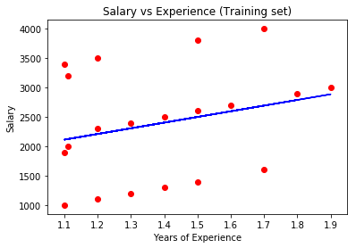
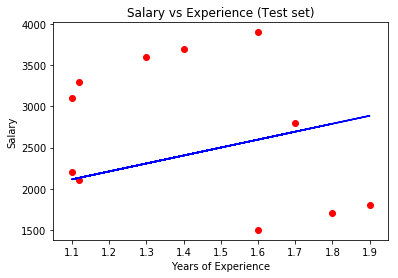

```python
import pandas as pd
import matplotlib.pyplot as plt
```


```python
file = "costos.csv"
```


```python
df = pd.read_csv(file) 
df.head()
```


<div>
<style scoped>
    .dataframe tbody tr th:only-of-type {
        vertical-align: middle;
    }

    .dataframe tbody tr th {
        vertical-align: top;
    }

    .dataframe thead th {
        text-align: right;
    }
</style>
<table border="1" class="dataframe">
  <thead>
    <tr style="text-align: right;">
      <th></th>
      <th>version</th>
      <th>costo</th>
    </tr>
  </thead>
  <tbody>
    <tr>
      <th>0</th>
      <td>1.1</td>
      <td>1000</td>
    </tr>
    <tr>
      <th>1</th>
      <td>1.2</td>
      <td>1100</td>
    </tr>
    <tr>
      <th>2</th>
      <td>1.3</td>
      <td>1200</td>
    </tr>
    <tr>
      <th>3</th>
      <td>1.4</td>
      <td>1300</td>
    </tr>
    <tr>
      <th>4</th>
      <td>1.5</td>
      <td>1400</td>
    </tr>
  </tbody>
</table>
</div>


```python
# Definimos quién es X y quién y
X = df.iloc[:, :-1].values
y = df.iloc[:, 1].values
```


```python
# Splitting the dataset into the Training set and Test set
from sklearn.model_selection import train_test_split
X_train, X_test, y_train, y_test = train_test_split(X, y, test_size = 1/3, random_state = 123)
```


```python
from sklearn.linear_model import LinearRegression 
model = LinearRegression()
model.fit(X_train, y_train)
```


    LinearRegression(copy_X=True, fit_intercept=True, n_jobs=None,
             normalize=False)


```python
# Predicting the Test set results 
y_pred = model.predict(X_test)
print ("Desempeño del modelo: ", model.score(X_test, y_test))
```

    Desempeño del modelo:  -0.43641217576487


```python
# Visualising the Training set results
plt.scatter(X_train, y_train, color = 'red') 
plt.plot(X_train, model.predict(X_train), color = 'blue') 
plt.title('Salary vs Experience (Training set)') 
plt.xlabel('Years of Experience')
plt.ylabel('Salary')
plt.show()
```





```python
# Visualising the Test set results
plt.scatter(X_test, y_test, color = 'red')
plt.plot(X_train, model.predict(X_train), color = 'blue')
plt.title('Salary vs Experience (Test set)')
plt.xlabel('Years of Experience')
plt.ylabel('Salary')
plt.show()
```





```python
from sklearn.model_selection import KFold
from sklearn.model_selection import train_test_split
from sklearn.model_selection import cross_val_score
```


```python
kf = KFold(n_splits=5, shuffle=True, random_state=123)
cv_scores = cross_val_score(model, X_train, y_train, cv=kf)
print("Desepeño de cross-validation con 5 volúmenes:", cv_scores.mean())
```

    Desepeño de cross-validation con 5 volúmenes: -0.3352773173112065

