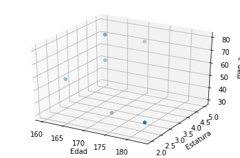
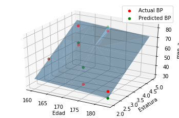

```python
import pandas as pd
from sklearn.linear_model import LinearRegression 
from sklearn.model_selection import train_test_split
from sklearn.model_selection import cross_val_score
```


```python
path="lan.csv"
df=pd.read_csv(path)
df.head()
```


<div>
<style scoped>
    .dataframe tbody tr th:only-of-type {
        vertical-align: middle;
    }

    .dataframe tbody tr th {
        vertical-align: top;
    }

    .dataframe thead th {
        text-align: right;
    }
</style>
<table border="1" class="dataframe">
  <thead>
    <tr style="text-align: right;">
      <th></th>
      <th>lan_uno</th>
      <th>lan_dos</th>
      <th>lan_tres</th>
      <th>lan_cuatro</th>
      <th>lan_cinco</th>
    </tr>
  </thead>
  <tbody>
    <tr>
      <th>0</th>
      <td>4</td>
      <td>2</td>
      <td>1</td>
      <td>34</td>
      <td>10</td>
    </tr>
    <tr>
      <th>1</th>
      <td>5</td>
      <td>2</td>
      <td>1</td>
      <td>23</td>
      <td>10</td>
    </tr>
    <tr>
      <th>2</th>
      <td>3</td>
      <td>2</td>
      <td>2</td>
      <td>74</td>
      <td>10</td>
    </tr>
    <tr>
      <th>3</th>
      <td>2</td>
      <td>2</td>
      <td>2</td>
      <td>98</td>
      <td>10</td>
    </tr>
    <tr>
      <th>4</th>
      <td>3</td>
      <td>2</td>
      <td>2</td>
      <td>23</td>
      <td>10</td>
    </tr>
  </tbody>
</table>
</div>


```python
dn=df.drop(columns=['lan_uno','lan_cuatro'],axis=1)
dn.head()
```


<div>
<style scoped>
    .dataframe tbody tr th:only-of-type {
        vertical-align: middle;
    }

    .dataframe tbody tr th {
        vertical-align: top;
    }

    .dataframe thead th {
        text-align: right;
    }
</style>
<table border="1" class="dataframe">
  <thead>
    <tr style="text-align: right;">
      <th></th>
      <th>lan_dos</th>
      <th>lan_tres</th>
      <th>lan_cinco</th>
    </tr>
  </thead>
  <tbody>
    <tr>
      <th>0</th>
      <td>2</td>
      <td>1</td>
      <td>10</td>
    </tr>
    <tr>
      <th>1</th>
      <td>2</td>
      <td>1</td>
      <td>10</td>
    </tr>
    <tr>
      <th>2</th>
      <td>2</td>
      <td>2</td>
      <td>10</td>
    </tr>
    <tr>
      <th>3</th>
      <td>2</td>
      <td>2</td>
      <td>10</td>
    </tr>
    <tr>
      <th>4</th>
      <td>2</td>
      <td>2</td>
      <td>10</td>
    </tr>
  </tbody>
</table>
</div>


```python
#saber cuantos O-rings sufren calentamiento
target = df.iloc[:, 1].values
x = dn.iloc[:, :].values
#print(x)
```


```python
X_train, X_test, Y_train, Y_test = train_test_split(x, target, test_size=0.1)
```


```python
lr = LinearRegression(normalize=True)
lr.fit(X_train, Y_train)
```


    LinearRegression(copy_X=True, fit_intercept=True, n_jobs=None, normalize=True)


```python
lr.score(X_test, Y_test)
```


    1.0


```python
scores = cross_val_score(lr, x,target, cv=2, scoring='neg_mean_squared_error')
```


```python
scores.mean()
```


    0.0


```python
scores.std()
```


    0.0


```python
scores = cross_val_score(lr, x,target, cv=3, scoring='r2')
```


```python
scores.mean()
```


    1.0


```python
scores.std()
```


    0.0


```python
print('y = ' + str(lr.intercept_) + ' ')
```

    y = 2.0 


```python
for i, c in enumerate(lr.coef_):
          print(str(c) + ' * x' + str(i))
```

    0.0 * x0
    0.0 * x1
    0.0 * x2


```python
x=dn.iloc[:, :-1].values
```


```python
import numpy as np
import matplotlib.pyplot as plt
from mpl_toolkits.mplot3d import Axes3D

# create arrays for the data points
X = []
Y = []

#read the csv file
csvReader = open('edad.csv')

#skips the header line
csvReader.readline()

for line in csvReader:
    y, x1, x2 = line.split(',')
    X.append([float(x1), float(x2), 1]) # add the bias term at the end
    Y.append(float(y))

# use numpy arrays so that we can use linear algebra later
X = np.array(X)
Y = np.array(Y)

# graph the data
fig = plt.figure(1)
ax = fig.add_subplot(111, projection='3d')
ax.scatter(X[:, 0], X[:, 1], Y)
ax.set_xlabel('Edad')
ax.set_ylabel('Estatura')
ax.set_zlabel('man_a')

# Use Linear Algebra to solve
a = np.linalg.solve(np.dot(X.T, X), np.dot(X.T, Y))
predictedY = np.dot(X, a)

# calculate the r-squared
SSres = Y - predictedY
SStot = Y - Y.mean()
rSquared = 1 - (SSres.dot(SSres) / SStot.dot(SStot))
print("the r-squared is: ", rSquared)
print("the coefficient (value of a) for edad, estatura, man_a is: ", a)

# create a wiremesh for the plane that the predicted values will lie
xx, yy, zz = np.meshgrid(X[:, 0], X[:, 1], X[:, 2])
combinedArrays = np.vstack((xx.flatten(), yy.flatten(), zz.flatten())).T
Z = combinedArrays.dot(a)

# graph the original data, predicted data, and wiremesh plane
fig = plt.figure(2)
ax = fig.add_subplot(111, projection='3d')
ax.scatter(X[:, 0], X[:, 1], Y, color='r', label='Actual BP')
ax.scatter(X[:, 0], X[:, 1], predictedY, color='g', label='Predicted BP')
ax.plot_trisurf(combinedArrays[:, 0], combinedArrays[:, 1], Z, alpha=0.5)
ax.set_xlabel('Edad')
ax.set_ylabel('Estatura')
ax.set_zlabel('man_a')
ax.legend()
plt.show()
```

    the r-squared is:  0.5897082570782648
    the coefficient (value of a) for edad, estatura, man_a is:  [-0.19593067 12.92388847 42.8786737 ]








```python

```
