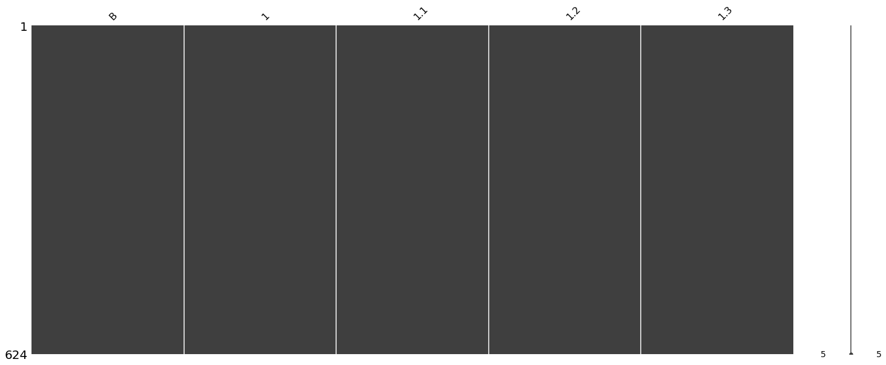
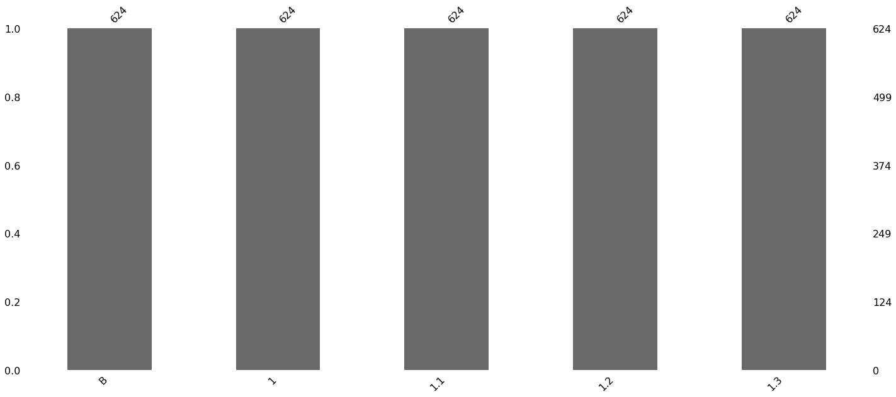

```python
conda install -c conda-forge mlxtend
```

    WARNING: The conda.compat module is deprecated and will be removed in a future release.
    Collecting package metadata: done
    Solving environment: done
    
    
    ==> WARNING: A newer version of conda exists. <==
      current version: 4.6.11
      latest version: 4.8.3
    
    Please update conda by running
    
        $ conda update -n base -c defaults conda
    
    
    
    ## Package Plan ##
    
      environment location: /home/raul/dev/anaconda3
    
      added / updated specs:
        - mlxtend
    
    
    The following packages will be downloaded:
    
        package                    |            build
        ---------------------------|-----------------
        _libgcc_mutex-0.1          |             main           2 KB  conda-forge
        certifi-2019.3.9           |           py37_0         149 KB  conda-forge
        conda-4.8.3                |   py37hc8dfbb8_1         3.0 MB  conda-forge
        conda-package-handling-1.6.0|   py37h8f50634_2         945 KB  conda-forge
        mlxtend-0.17.1             |             py_0         1.2 MB  conda-forge
        python_abi-3.7             |          1_cp37m           4 KB  conda-forge
        ------------------------------------------------------------
                                               Total:         5.3 MB
    
    The following NEW packages will be INSTALLED:
    
      _libgcc_mutex      conda-forge/linux-64::_libgcc_mutex-0.1-main
      conda-package-han~ conda-forge/linux-64::conda-package-handling-1.6.0-py37h8f50634_2
      mlxtend            conda-forge/noarch::mlxtend-0.17.1-py_0
      python_abi         conda-forge/linux-64::python_abi-3.7-1_cp37m
    
    The following packages will be UPDATED:
    
      conda                      pkgs/main::conda-4.6.11-py37_0 --> conda-forge::conda-4.8.3-py37hc8dfbb8_1
    
    The following packages will be SUPERSEDED by a higher-priority channel:
    
      certifi                                         pkgs/main --> conda-forge
    
    
    
    Downloading and Extracting Packages
    certifi-2019.3.9     | 149 KB    | ##################################### | 100% 
    _libgcc_mutex-0.1    | 2 KB      | ##################################### | 100% 
    conda-4.8.3          | 3.0 MB    | ##################################### | 100% 
    mlxtend-0.17.1       | 1.2 MB    | ##################################### | 100% 
    conda-package-handli | 945 KB    | ##################################### | 100% 
    python_abi-3.7       | 4 KB      | ##################################### | 100% 
    Preparing transaction: done
    Verifying transaction: done
    Executing transaction: done
    
    Note: you may need to restart the kernel to use updated packages.


```python
conda install -c conda-forge missingno
```

    Collecting package metadata (repodata.json): done
    Solving environment: | 
    The environment is inconsistent, please check the package plan carefully
    The following packages are causing the inconsistency:
    
      - defaults/linux-64::numba==0.43.1=py37h962f231_0
      - defaults/linux-64::anaconda==2019.03=py37_0
    done
    
    ## Package Plan ##
    
      environment location: /home/raul/dev/anaconda3
    
      added / updated specs:
        - missingno
    
    
    The following packages will be downloaded:
    
        package                    |            build
        ---------------------------|-----------------
        _anaconda_depends-2019.03  |           py37_0           5 KB
        anaconda-custom            |           py37_1           3 KB
        ca-certificates-2020.4.5.1 |       hecc5488_0         146 KB  conda-forge
        certifi-2020.4.5.1         |   py37hc8dfbb8_0         151 KB  conda-forge
        missingno-0.4.2            |             py_0          12 KB  conda-forge
        openssl-1.1.1f             |       h516909a_0         2.1 MB  conda-forge
        tbb-2020.1                 |       hc9558a2_0         1.4 MB  conda-forge
        ------------------------------------------------------------
                                               Total:         3.9 MB
    
    The following NEW packages will be INSTALLED:
    
      _anaconda_depends  pkgs/main/linux-64::_anaconda_depends-2019.03-py37_0
      missingno          conda-forge/noarch::missingno-0.4.2-py_0
      tbb                conda-forge/linux-64::tbb-2020.1-hc9558a2_0
    
    The following packages will be UPDATED:
    
      ca-certificates    pkgs/main::ca-certificates-2019.1.23-0 --> conda-forge::ca-certificates-2020.4.5.1-hecc5488_0
      certifi                                   2019.3.9-py37_0 --> 2020.4.5.1-py37hc8dfbb8_0
      openssl              pkgs/main::openssl-1.1.1b-h7b6447c_1 --> conda-forge::openssl-1.1.1f-h516909a_0
    
    The following packages will be DOWNGRADED:
    
      anaconda                                   2019.03-py37_0 --> custom-py37_1
    
    
    
    Downloading and Extracting Packages
    certifi-2020.4.5.1   | 151 KB    | ##################################### | 100% 
    missingno-0.4.2      | 12 KB     | ##################################### | 100% 
    _anaconda_depends-20 | 5 KB      | ##################################### | 100% 
    ca-certificates-2020 | 146 KB    | ##################################### | 100% 
    tbb-2020.1           | 1.4 MB    | ##################################### | 100% 
    openssl-1.1.1f       | 2.1 MB    | ##################################### | 100% 
    anaconda-custom      | 3 KB      | ##################################### | 100% 
    Preparing transaction: done
    Verifying transaction: done
    Executing transaction: done
    
    Note: you may need to restart the kernel to use updated packages.


```python
import pandas as pd
import numpy as np
from mlxtend.frequent_patterns import apriori, association_rules
import matplotlib.pyplot as plt
import missingno as msno
```


```python
path='balance-scale.data'
df=pd.read_csv(path)
df.head()
```


<div>
<style scoped>
    .dataframe tbody tr th:only-of-type {
        vertical-align: middle;
    }

    .dataframe tbody tr th {
        vertical-align: top;
    }

    .dataframe thead th {
        text-align: right;
    }
</style>
<table border="1" class="dataframe">
  <thead>
    <tr style="text-align: right;">
      <th></th>
      <th>B</th>
      <th>1</th>
      <th>1.1</th>
      <th>1.2</th>
      <th>1.3</th>
    </tr>
  </thead>
  <tbody>
    <tr>
      <th>0</th>
      <td>R</td>
      <td>1</td>
      <td>1</td>
      <td>1</td>
      <td>2</td>
    </tr>
    <tr>
      <th>1</th>
      <td>R</td>
      <td>1</td>
      <td>1</td>
      <td>1</td>
      <td>3</td>
    </tr>
    <tr>
      <th>2</th>
      <td>R</td>
      <td>1</td>
      <td>1</td>
      <td>1</td>
      <td>4</td>
    </tr>
    <tr>
      <th>3</th>
      <td>R</td>
      <td>1</td>
      <td>1</td>
      <td>1</td>
      <td>5</td>
    </tr>
    <tr>
      <th>4</th>
      <td>R</td>
      <td>1</td>
      <td>1</td>
      <td>2</td>
      <td>1</td>
    </tr>
  </tbody>
</table>
</div>


```python
msno.matrix(df)
```


    <matplotlib.axes._subplots.AxesSubplot at 0x7f917b869470>





```python
msno.bar(df)
```


    <matplotlib.axes._subplots.AxesSubplot at 0x7f917b2b45f8>





```python
items = (df['B'].unique())
items
```


    array(['R', 'L', 'B'], dtype=object)


```python
encoded_vals = []

for index, row in df.iterrows():
    labels = {}
    uncommons = list(set(items) - set(row))
    commons = list(set(items).intersection(row))
    for uc in uncommons:
        labels[uc] = 0
    for com in commons:
        labels[com] = 1
    encoded_vals.append(labels)
```


```python
ohe_df = pd.DataFrame(encoded_vals)
ohe_df.head()
```


<div>
<style scoped>
    .dataframe tbody tr th:only-of-type {
        vertical-align: middle;
    }

    .dataframe tbody tr th {
        vertical-align: top;
    }

    .dataframe thead th {
        text-align: right;
    }
</style>
<table border="1" class="dataframe">
  <thead>
    <tr style="text-align: right;">
      <th></th>
      <th>B</th>
      <th>L</th>
      <th>R</th>
    </tr>
  </thead>
  <tbody>
    <tr>
      <th>0</th>
      <td>0</td>
      <td>0</td>
      <td>1</td>
    </tr>
    <tr>
      <th>1</th>
      <td>0</td>
      <td>0</td>
      <td>1</td>
    </tr>
    <tr>
      <th>2</th>
      <td>0</td>
      <td>0</td>
      <td>1</td>
    </tr>
    <tr>
      <th>3</th>
      <td>0</td>
      <td>0</td>
      <td>1</td>
    </tr>
    <tr>
      <th>4</th>
      <td>0</td>
      <td>0</td>
      <td>1</td>
    </tr>
  </tbody>
</table>
</div>


```python
freq_items = apriori(ohe_df, min_support=0.2, use_colnames=True, verbose=1)
freq_items.head()
```

    Processing 2 combinations | Sampling itemset size 2


<div>
<style scoped>
    .dataframe tbody tr th:only-of-type {
        vertical-align: middle;
    }

    .dataframe tbody tr th {
        vertical-align: top;
    }

    .dataframe thead th {
        text-align: right;
    }
</style>
<table border="1" class="dataframe">
  <thead>
    <tr style="text-align: right;">
      <th></th>
      <th>support</th>
      <th>itemsets</th>
    </tr>
  </thead>
  <tbody>
    <tr>
      <th>0</th>
      <td>0.461538</td>
      <td>(L)</td>
    </tr>
    <tr>
      <th>1</th>
      <td>0.461538</td>
      <td>(R)</td>
    </tr>
  </tbody>
</table>
</div>


```python
freq_items.itemsets.unique()
```


    array([frozenset({'L'}), frozenset({'R'})], dtype=object)


```python
rules = association_rules(freq_items, min_threshold=0.6)
rules
```


<div>
<style scoped>
    .dataframe tbody tr th:only-of-type {
        vertical-align: middle;
    }

    .dataframe tbody tr th {
        vertical-align: top;
    }

    .dataframe thead th {
        text-align: right;
    }
</style>
<table border="1" class="dataframe">
  <thead>
    <tr style="text-align: right;">
      <th></th>
      <th>antecedents</th>
      <th>consequents</th>
      <th>antecedent support</th>
      <th>consequent support</th>
      <th>support</th>
      <th>confidence</th>
      <th>lift</th>
      <th>leverage</th>
      <th>conviction</th>
    </tr>
  </thead>
  <tbody>
  </tbody>
</table>
</div>


