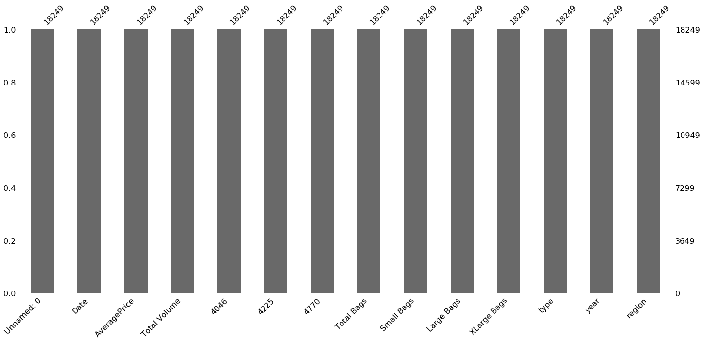

```python
conda install -c conda-forge/label/gcc7 missingno
```

    Collecting package metadata (current_repodata.json): done
    Solving environment: done
    
    # All requested packages already installed.
    
    
    Note: you may need to restart the kernel to use updated packages.


```python
import pandas as pd
import numpy as np
import missingno as msno
%matplotlib inline
```


```python
#https://www.kaggle.com/neuromusic/avocado-prices
path = 'avocado.csv'
df = pd.read_csv(path, encoding='latin', error_bad_lines=False)
df.head()
```


```python
df.info()
```

    <class 'pandas.core.frame.DataFrame'>
    RangeIndex: 18249 entries, 0 to 18248
    Data columns (total 14 columns):
    Unnamed: 0      18249 non-null int64
    Date            18249 non-null object
    AveragePrice    18249 non-null float64
    Total Volume    18249 non-null float64
    4046            18249 non-null float64
    4225            18249 non-null float64
    4770            18249 non-null float64
    Total Bags      18249 non-null float64
    Small Bags      18249 non-null float64
    Large Bags      18249 non-null float64
    XLarge Bags     18249 non-null float64
    type            18249 non-null object
    year            18249 non-null int64
    region          18249 non-null object
    dtypes: float64(9), int64(2), object(3)
    memory usage: 1.9+ MB


```python
df.shape
```


    (18249, 14)


```python
df.shape[0]
```


    18249


```python
df.shape[1]
```


    14


```python
df.columns.values.tolist()
```


    ['Unnamed: 0',
     'Date',
     'AveragePrice',
     'Total Volume',
     '4046',
     '4225',
     '4770',
     'Total Bags',
     'Small Bags',
     'Large Bags',
     'XLarge Bags',
     'type',
     'year',
     'region']


```python
df.dtypes
```


    Unnamed: 0        int64
    Date             object
    AveragePrice    float64
    Total Volume    float64
    4046            float64
    4225            float64
    4770            float64
    Total Bags      float64
    Small Bags      float64
    Large Bags      float64
    XLarge Bags     float64
    type             object
    year              int64
    region           object
    dtype: object


```python
df.isnull().any().any()
```


    False


```python
msno.matrix(df)
```


    <matplotlib.axes._subplots.AxesSubplot at 0x7fc7768d85d0>


```python
df.replace({' ': np.nan}, inplace=True)
```


```python
df.isnull().any().any()
```


    False


```python
msno.matrix(df)
```


    <matplotlib.axes._subplots.AxesSubplot at 0x7fc7766f3490>


```python
msno.bar(df)
```


    <matplotlib.axes._subplots.AxesSubplot at 0x7fc7767a1e50>





```python
df.columns[df.isnull().any()].tolist()
```


    []


```python
df.describe()
```


<div>
<style scoped>
    .dataframe tbody tr th:only-of-type {
        vertical-align: middle;
    }

    .dataframe tbody tr th {
        vertical-align: top;
    }

    .dataframe thead th {
        text-align: right;
    }
</style>
<table border="1" class="dataframe">
  <thead>
    <tr style="text-align: right;">
      <th></th>
      <th>Unnamed: 0</th>
      <th>AveragePrice</th>
      <th>Total Volume</th>
      <th>4046</th>
      <th>4225</th>
      <th>4770</th>
      <th>Total Bags</th>
      <th>Small Bags</th>
      <th>Large Bags</th>
      <th>XLarge Bags</th>
      <th>year</th>
    </tr>
  </thead>
  <tbody>
    <tr>
      <td>count</td>
      <td>18249.000000</td>
      <td>18249.000000</td>
      <td>1.824900e+04</td>
      <td>1.824900e+04</td>
      <td>1.824900e+04</td>
      <td>1.824900e+04</td>
      <td>1.824900e+04</td>
      <td>1.824900e+04</td>
      <td>1.824900e+04</td>
      <td>18249.000000</td>
      <td>18249.000000</td>
    </tr>
    <tr>
      <td>mean</td>
      <td>24.232232</td>
      <td>1.405978</td>
      <td>8.506440e+05</td>
      <td>2.930084e+05</td>
      <td>2.951546e+05</td>
      <td>2.283974e+04</td>
      <td>2.396392e+05</td>
      <td>1.821947e+05</td>
      <td>5.433809e+04</td>
      <td>3106.426507</td>
      <td>2016.147899</td>
    </tr>
    <tr>
      <td>std</td>
      <td>15.481045</td>
      <td>0.402677</td>
      <td>3.453545e+06</td>
      <td>1.264989e+06</td>
      <td>1.204120e+06</td>
      <td>1.074641e+05</td>
      <td>9.862424e+05</td>
      <td>7.461785e+05</td>
      <td>2.439660e+05</td>
      <td>17692.894652</td>
      <td>0.939938</td>
    </tr>
    <tr>
      <td>min</td>
      <td>0.000000</td>
      <td>0.440000</td>
      <td>8.456000e+01</td>
      <td>0.000000e+00</td>
      <td>0.000000e+00</td>
      <td>0.000000e+00</td>
      <td>0.000000e+00</td>
      <td>0.000000e+00</td>
      <td>0.000000e+00</td>
      <td>0.000000</td>
      <td>2015.000000</td>
    </tr>
    <tr>
      <td>25%</td>
      <td>10.000000</td>
      <td>1.100000</td>
      <td>1.083858e+04</td>
      <td>8.540700e+02</td>
      <td>3.008780e+03</td>
      <td>0.000000e+00</td>
      <td>5.088640e+03</td>
      <td>2.849420e+03</td>
      <td>1.274700e+02</td>
      <td>0.000000</td>
      <td>2015.000000</td>
    </tr>
    <tr>
      <td>50%</td>
      <td>24.000000</td>
      <td>1.370000</td>
      <td>1.073768e+05</td>
      <td>8.645300e+03</td>
      <td>2.906102e+04</td>
      <td>1.849900e+02</td>
      <td>3.974383e+04</td>
      <td>2.636282e+04</td>
      <td>2.647710e+03</td>
      <td>0.000000</td>
      <td>2016.000000</td>
    </tr>
    <tr>
      <td>75%</td>
      <td>38.000000</td>
      <td>1.660000</td>
      <td>4.329623e+05</td>
      <td>1.110202e+05</td>
      <td>1.502069e+05</td>
      <td>6.243420e+03</td>
      <td>1.107834e+05</td>
      <td>8.333767e+04</td>
      <td>2.202925e+04</td>
      <td>132.500000</td>
      <td>2017.000000</td>
    </tr>
    <tr>
      <td>max</td>
      <td>52.000000</td>
      <td>3.250000</td>
      <td>6.250565e+07</td>
      <td>2.274362e+07</td>
      <td>2.047057e+07</td>
      <td>2.546439e+06</td>
      <td>1.937313e+07</td>
      <td>1.338459e+07</td>
      <td>5.719097e+06</td>
      <td>551693.650000</td>
      <td>2018.000000</td>
    </tr>
  </tbody>
</table>
</div>


```python
df.loc[[0]]
```


<div>
<style scoped>
    .dataframe tbody tr th:only-of-type {
        vertical-align: middle;
    }

    .dataframe tbody tr th {
        vertical-align: top;
    }

    .dataframe thead th {
        text-align: right;
    }
</style>
<table border="1" class="dataframe">
  <thead>
    <tr style="text-align: right;">
      <th></th>
      <th>Unnamed: 0</th>
      <th>Date</th>
      <th>AveragePrice</th>
      <th>Total Volume</th>
      <th>4046</th>
      <th>4225</th>
      <th>4770</th>
      <th>Total Bags</th>
      <th>Small Bags</th>
      <th>Large Bags</th>
      <th>XLarge Bags</th>
      <th>type</th>
      <th>year</th>
      <th>region</th>
    </tr>
  </thead>
  <tbody>
    <tr>
      <td>0</td>
      <td>0</td>
      <td>2015-12-27</td>
      <td>1.33</td>
      <td>64236.62</td>
      <td>1036.74</td>
      <td>54454.85</td>
      <td>48.16</td>
      <td>8696.87</td>
      <td>8603.62</td>
      <td>93.25</td>
      <td>0.0</td>
      <td>conventional</td>
      <td>2015</td>
      <td>Albany</td>
    </tr>
  </tbody>
</table>
</div>


```python
df.loc[30:33]
```


<div>
<style scoped>
    .dataframe tbody tr th:only-of-type {
        vertical-align: middle;
    }

    .dataframe tbody tr th {
        vertical-align: top;
    }

    .dataframe thead th {
        text-align: right;
    }
</style>
<table border="1" class="dataframe">
  <thead>
    <tr style="text-align: right;">
      <th></th>
      <th>Unnamed: 0</th>
      <th>Date</th>
      <th>AveragePrice</th>
      <th>Total Volume</th>
      <th>4046</th>
      <th>4225</th>
      <th>4770</th>
      <th>Total Bags</th>
      <th>Small Bags</th>
      <th>Large Bags</th>
      <th>XLarge Bags</th>
      <th>type</th>
      <th>year</th>
      <th>region</th>
    </tr>
  </thead>
  <tbody>
    <tr>
      <td>30</td>
      <td>30</td>
      <td>2015-05-31</td>
      <td>1.23</td>
      <td>95123.62</td>
      <td>922.37</td>
      <td>70469.69</td>
      <td>50.55</td>
      <td>23681.01</td>
      <td>23222.49</td>
      <td>458.52</td>
      <td>0.0</td>
      <td>conventional</td>
      <td>2015</td>
      <td>Albany</td>
    </tr>
    <tr>
      <td>31</td>
      <td>31</td>
      <td>2015-05-24</td>
      <td>1.19</td>
      <td>101470.91</td>
      <td>680.27</td>
      <td>71376.81</td>
      <td>58.70</td>
      <td>29355.13</td>
      <td>28761.81</td>
      <td>593.32</td>
      <td>0.0</td>
      <td>conventional</td>
      <td>2015</td>
      <td>Albany</td>
    </tr>
    <tr>
      <td>32</td>
      <td>32</td>
      <td>2015-05-17</td>
      <td>1.43</td>
      <td>109857.47</td>
      <td>1150.55</td>
      <td>81955.16</td>
      <td>94.32</td>
      <td>26657.44</td>
      <td>26285.43</td>
      <td>372.01</td>
      <td>0.0</td>
      <td>conventional</td>
      <td>2015</td>
      <td>Albany</td>
    </tr>
    <tr>
      <td>33</td>
      <td>33</td>
      <td>2015-05-10</td>
      <td>1.26</td>
      <td>120427.91</td>
      <td>1420.43</td>
      <td>102000.52</td>
      <td>185.66</td>
      <td>16821.30</td>
      <td>16535.55</td>
      <td>285.75</td>
      <td>0.0</td>
      <td>conventional</td>
      <td>2015</td>
      <td>Albany</td>
    </tr>
  </tbody>
</table>
</div>


```python
df.drop([0,24,51], axis=0).head()
```


<div>
<style scoped>
    .dataframe tbody tr th:only-of-type {
        vertical-align: middle;
    }

    .dataframe tbody tr th {
        vertical-align: top;
    }

    .dataframe thead th {
        text-align: right;
    }
</style>
<table border="1" class="dataframe">
  <thead>
    <tr style="text-align: right;">
      <th></th>
      <th>Unnamed: 0</th>
      <th>Date</th>
      <th>AveragePrice</th>
      <th>Total Volume</th>
      <th>4046</th>
      <th>4225</th>
      <th>4770</th>
      <th>Total Bags</th>
      <th>Small Bags</th>
      <th>Large Bags</th>
      <th>XLarge Bags</th>
      <th>type</th>
      <th>year</th>
      <th>region</th>
    </tr>
  </thead>
  <tbody>
    <tr>
      <td>1</td>
      <td>1</td>
      <td>2015-12-20</td>
      <td>1.35</td>
      <td>54876.98</td>
      <td>674.28</td>
      <td>44638.81</td>
      <td>58.33</td>
      <td>9505.56</td>
      <td>9408.07</td>
      <td>97.49</td>
      <td>0.0</td>
      <td>conventional</td>
      <td>2015</td>
      <td>Albany</td>
    </tr>
    <tr>
      <td>2</td>
      <td>2</td>
      <td>2015-12-13</td>
      <td>0.93</td>
      <td>118220.22</td>
      <td>794.70</td>
      <td>109149.67</td>
      <td>130.50</td>
      <td>8145.35</td>
      <td>8042.21</td>
      <td>103.14</td>
      <td>0.0</td>
      <td>conventional</td>
      <td>2015</td>
      <td>Albany</td>
    </tr>
    <tr>
      <td>3</td>
      <td>3</td>
      <td>2015-12-06</td>
      <td>1.08</td>
      <td>78992.15</td>
      <td>1132.00</td>
      <td>71976.41</td>
      <td>72.58</td>
      <td>5811.16</td>
      <td>5677.40</td>
      <td>133.76</td>
      <td>0.0</td>
      <td>conventional</td>
      <td>2015</td>
      <td>Albany</td>
    </tr>
    <tr>
      <td>4</td>
      <td>4</td>
      <td>2015-11-29</td>
      <td>1.28</td>
      <td>51039.60</td>
      <td>941.48</td>
      <td>43838.39</td>
      <td>75.78</td>
      <td>6183.95</td>
      <td>5986.26</td>
      <td>197.69</td>
      <td>0.0</td>
      <td>conventional</td>
      <td>2015</td>
      <td>Albany</td>
    </tr>
    <tr>
      <td>5</td>
      <td>5</td>
      <td>2015-11-22</td>
      <td>1.26</td>
      <td>55979.78</td>
      <td>1184.27</td>
      <td>48067.99</td>
      <td>43.61</td>
      <td>6683.91</td>
      <td>6556.47</td>
      <td>127.44</td>
      <td>0.0</td>
      <td>conventional</td>
      <td>2015</td>
      <td>Albany</td>
    </tr>
  </tbody>
</table>
</div>


```python
df.drop(df.index[1:5], axis=0).head(10)
```


<div>
<style scoped>
    .dataframe tbody tr th:only-of-type {
        vertical-align: middle;
    }

    .dataframe tbody tr th {
        vertical-align: top;
    }

    .dataframe thead th {
        text-align: right;
    }
</style>
<table border="1" class="dataframe">
  <thead>
    <tr style="text-align: right;">
      <th></th>
      <th>Unnamed: 0</th>
      <th>Date</th>
      <th>AveragePrice</th>
      <th>Total Volume</th>
      <th>4046</th>
      <th>4225</th>
      <th>4770</th>
      <th>Total Bags</th>
      <th>Small Bags</th>
      <th>Large Bags</th>
      <th>XLarge Bags</th>
      <th>type</th>
      <th>year</th>
      <th>region</th>
    </tr>
  </thead>
  <tbody>
    <tr>
      <td>0</td>
      <td>0</td>
      <td>2015-12-27</td>
      <td>1.33</td>
      <td>64236.62</td>
      <td>1036.74</td>
      <td>54454.85</td>
      <td>48.16</td>
      <td>8696.87</td>
      <td>8603.62</td>
      <td>93.25</td>
      <td>0.0</td>
      <td>conventional</td>
      <td>2015</td>
      <td>Albany</td>
    </tr>
    <tr>
      <td>5</td>
      <td>5</td>
      <td>2015-11-22</td>
      <td>1.26</td>
      <td>55979.78</td>
      <td>1184.27</td>
      <td>48067.99</td>
      <td>43.61</td>
      <td>6683.91</td>
      <td>6556.47</td>
      <td>127.44</td>
      <td>0.0</td>
      <td>conventional</td>
      <td>2015</td>
      <td>Albany</td>
    </tr>
    <tr>
      <td>6</td>
      <td>6</td>
      <td>2015-11-15</td>
      <td>0.99</td>
      <td>83453.76</td>
      <td>1368.92</td>
      <td>73672.72</td>
      <td>93.26</td>
      <td>8318.86</td>
      <td>8196.81</td>
      <td>122.05</td>
      <td>0.0</td>
      <td>conventional</td>
      <td>2015</td>
      <td>Albany</td>
    </tr>
    <tr>
      <td>7</td>
      <td>7</td>
      <td>2015-11-08</td>
      <td>0.98</td>
      <td>109428.33</td>
      <td>703.75</td>
      <td>101815.36</td>
      <td>80.00</td>
      <td>6829.22</td>
      <td>6266.85</td>
      <td>562.37</td>
      <td>0.0</td>
      <td>conventional</td>
      <td>2015</td>
      <td>Albany</td>
    </tr>
    <tr>
      <td>8</td>
      <td>8</td>
      <td>2015-11-01</td>
      <td>1.02</td>
      <td>99811.42</td>
      <td>1022.15</td>
      <td>87315.57</td>
      <td>85.34</td>
      <td>11388.36</td>
      <td>11104.53</td>
      <td>283.83</td>
      <td>0.0</td>
      <td>conventional</td>
      <td>2015</td>
      <td>Albany</td>
    </tr>
    <tr>
      <td>9</td>
      <td>9</td>
      <td>2015-10-25</td>
      <td>1.07</td>
      <td>74338.76</td>
      <td>842.40</td>
      <td>64757.44</td>
      <td>113.00</td>
      <td>8625.92</td>
      <td>8061.47</td>
      <td>564.45</td>
      <td>0.0</td>
      <td>conventional</td>
      <td>2015</td>
      <td>Albany</td>
    </tr>
    <tr>
      <td>10</td>
      <td>10</td>
      <td>2015-10-18</td>
      <td>1.12</td>
      <td>84843.44</td>
      <td>924.86</td>
      <td>75595.85</td>
      <td>117.07</td>
      <td>8205.66</td>
      <td>7877.86</td>
      <td>327.80</td>
      <td>0.0</td>
      <td>conventional</td>
      <td>2015</td>
      <td>Albany</td>
    </tr>
    <tr>
      <td>11</td>
      <td>11</td>
      <td>2015-10-11</td>
      <td>1.28</td>
      <td>64489.17</td>
      <td>1582.03</td>
      <td>52677.92</td>
      <td>105.32</td>
      <td>10123.90</td>
      <td>9866.27</td>
      <td>257.63</td>
      <td>0.0</td>
      <td>conventional</td>
      <td>2015</td>
      <td>Albany</td>
    </tr>
    <tr>
      <td>12</td>
      <td>12</td>
      <td>2015-10-04</td>
      <td>1.31</td>
      <td>61007.10</td>
      <td>2268.32</td>
      <td>49880.67</td>
      <td>101.36</td>
      <td>8756.75</td>
      <td>8379.98</td>
      <td>376.77</td>
      <td>0.0</td>
      <td>conventional</td>
      <td>2015</td>
      <td>Albany</td>
    </tr>
    <tr>
      <td>13</td>
      <td>13</td>
      <td>2015-09-27</td>
      <td>0.99</td>
      <td>106803.39</td>
      <td>1204.88</td>
      <td>99409.21</td>
      <td>154.84</td>
      <td>6034.46</td>
      <td>5888.87</td>
      <td>145.59</td>
      <td>0.0</td>
      <td>conventional</td>
      <td>2015</td>
      <td>Albany</td>
    </tr>
  </tbody>
</table>
</div>


```python
df[100:].head() #df.tail(-100) )
```


<div>
<style scoped>
    .dataframe tbody tr th:only-of-type {
        vertical-align: middle;
    }

    .dataframe tbody tr th {
        vertical-align: top;
    }

    .dataframe thead th {
        text-align: right;
    }
</style>
<table border="1" class="dataframe">
  <thead>
    <tr style="text-align: right;">
      <th></th>
      <th>Unnamed: 0</th>
      <th>Date</th>
      <th>AveragePrice</th>
      <th>Total Volume</th>
      <th>4046</th>
      <th>4225</th>
      <th>4770</th>
      <th>Total Bags</th>
      <th>Small Bags</th>
      <th>Large Bags</th>
      <th>XLarge Bags</th>
      <th>type</th>
      <th>year</th>
      <th>region</th>
    </tr>
  </thead>
  <tbody>
    <tr>
      <td>100</td>
      <td>48</td>
      <td>2015-01-25</td>
      <td>1.10</td>
      <td>449332.85</td>
      <td>393408.17</td>
      <td>18718.27</td>
      <td>594.25</td>
      <td>36612.16</td>
      <td>13176.39</td>
      <td>23435.77</td>
      <td>0.0</td>
      <td>conventional</td>
      <td>2015</td>
      <td>Atlanta</td>
    </tr>
    <tr>
      <td>101</td>
      <td>49</td>
      <td>2015-01-18</td>
      <td>1.11</td>
      <td>431490.99</td>
      <td>372236.92</td>
      <td>18701.90</td>
      <td>511.69</td>
      <td>40040.48</td>
      <td>16782.71</td>
      <td>23257.77</td>
      <td>0.0</td>
      <td>conventional</td>
      <td>2015</td>
      <td>Atlanta</td>
    </tr>
    <tr>
      <td>102</td>
      <td>50</td>
      <td>2015-01-11</td>
      <td>1.11</td>
      <td>397542.72</td>
      <td>330411.24</td>
      <td>18958.22</td>
      <td>1135.18</td>
      <td>47038.08</td>
      <td>21309.61</td>
      <td>25728.47</td>
      <td>0.0</td>
      <td>conventional</td>
      <td>2015</td>
      <td>Atlanta</td>
    </tr>
    <tr>
      <td>103</td>
      <td>51</td>
      <td>2015-01-04</td>
      <td>1.00</td>
      <td>435021.49</td>
      <td>364302.39</td>
      <td>23821.16</td>
      <td>82.15</td>
      <td>46815.79</td>
      <td>16707.15</td>
      <td>30108.64</td>
      <td>0.0</td>
      <td>conventional</td>
      <td>2015</td>
      <td>Atlanta</td>
    </tr>
    <tr>
      <td>104</td>
      <td>0</td>
      <td>2015-12-27</td>
      <td>1.17</td>
      <td>596819.40</td>
      <td>40450.49</td>
      <td>394104.02</td>
      <td>17353.79</td>
      <td>144911.10</td>
      <td>142543.88</td>
      <td>2367.22</td>
      <td>0.0</td>
      <td>conventional</td>
      <td>2015</td>
      <td>BaltimoreWashington</td>
    </tr>
  </tbody>
</table>
</div>


```python
df.AveragePrice.values
```


    array([1.33, 1.35, 0.93, ..., 1.87, 1.93, 1.62])


```python
df['AveragePrice'].values
```


    array([1.33, 1.35, 0.93, ..., 1.87, 1.93, 1.62])


```python
df.AveragePrice.unique()
```


    array([1.33, 1.35, 0.93, 1.08, 1.28, 1.26, 0.99, 0.98, 1.02, 1.07, 1.12,
           1.31, 1.11, 1.34, 1.45, 1.05, 1.37, 1.27, 1.32, 1.23, 1.19, 1.43,
           1.2 , 1.22, 1.13, 1.16, 1.06, 1.17, 1.24, 0.96, 1.  , 1.09, 0.95,
           0.97, 1.15, 1.01, 1.14, 1.1 , 1.04, 1.03, 1.18, 1.29, 1.25, 0.71,
           0.94, 0.91, 1.39, 1.4 , 1.36, 1.3 , 1.54, 1.59, 1.56, 1.38, 1.49,
           1.5 , 1.47, 1.42, 1.41, 1.44, 1.52, 0.9 , 0.87, 0.78, 0.92, 0.83,
           0.88, 0.84, 0.85, 1.21, 0.79, 0.89, 0.86, 0.8 , 0.82, 0.74, 0.81,
           0.77, 0.75, 0.65, 0.73, 0.68, 0.72, 0.67, 0.76, 0.62, 0.7 , 0.66,
           1.46, 0.49, 0.53, 0.56, 0.6 , 0.58, 0.54, 0.52, 0.51, 0.57, 0.63,
           0.64, 0.61, 1.48, 1.55, 1.58, 1.53, 1.57, 1.51, 0.69, 1.62, 1.63,
           1.61, 1.6 , 1.73, 1.8 , 1.86, 1.85, 1.69, 1.66, 1.65, 1.64, 1.67,
           1.68, 1.82, 2.07, 1.84, 1.83, 1.7 , 1.72, 1.81, 1.78, 0.59, 1.9 ,
           1.93, 1.99, 1.95, 1.89, 1.76, 1.71, 1.74, 0.55, 1.79, 1.75, 1.94,
           2.2 , 1.87, 1.77, 2.06, 2.11, 2.22, 2.14, 2.15, 2.02, 2.  , 1.88,
           1.96, 2.19, 2.09, 1.98, 1.97, 1.92, 2.04, 0.46, 2.01, 2.08, 2.03,
           2.05, 2.28, 2.35, 2.29, 1.91, 2.18, 2.24, 2.12, 2.13, 2.16, 2.32,
           2.34, 2.33, 2.31, 2.23, 2.27, 2.3 , 2.41, 2.36, 2.37, 2.39, 2.42,
           2.45, 2.38, 2.4 , 2.25, 2.26, 2.17, 2.21, 2.1 , 2.58, 2.79, 2.66,
           2.59, 2.74, 2.73, 2.77, 2.71, 2.72, 2.76, 2.75, 2.49, 2.54, 2.67,
           2.68, 2.57, 2.85, 3.03, 2.91, 2.44, 2.65, 2.46, 2.62, 2.47, 2.55,
           2.52, 2.61, 2.82, 2.51, 2.56, 2.88, 2.94, 2.99, 3.12, 3.25, 2.93,
           2.64, 2.89, 2.83, 2.78, 2.63, 2.8 , 2.48, 2.5 , 2.53, 0.44, 0.48,
           2.6 , 2.43, 2.81, 3.05, 2.87, 2.86, 2.84, 3.  , 2.92, 2.97, 3.04,
           2.9 , 2.7 , 2.69, 2.96, 2.95, 3.17])


```python
df.AveragePrice.value_counts()
```


    1.15    202
    1.18    199
    1.08    194
    1.26    193
    1.13    192
           ... 
    3.05      1
    3.03      1
    2.91      1
    0.48      1
    2.96      1
    Name: AveragePrice, Length: 259, dtype: int64


```python
df.agg(['count', 'size', 'nunique'])
```


<div>
<style scoped>
    .dataframe tbody tr th:only-of-type {
        vertical-align: middle;
    }

    .dataframe tbody tr th {
        vertical-align: top;
    }

    .dataframe thead th {
        text-align: right;
    }
</style>
<table border="1" class="dataframe">
  <thead>
    <tr style="text-align: right;">
      <th></th>
      <th>Unnamed: 0</th>
      <th>Date</th>
      <th>AveragePrice</th>
      <th>Total Volume</th>
      <th>4046</th>
      <th>4225</th>
      <th>4770</th>
      <th>Total Bags</th>
      <th>Small Bags</th>
      <th>Large Bags</th>
      <th>XLarge Bags</th>
      <th>type</th>
      <th>year</th>
      <th>region</th>
    </tr>
  </thead>
  <tbody>
    <tr>
      <td>count</td>
      <td>18249</td>
      <td>18249</td>
      <td>18249</td>
      <td>18249</td>
      <td>18249</td>
      <td>18249</td>
      <td>18249</td>
      <td>18249</td>
      <td>18249</td>
      <td>18249</td>
      <td>18249</td>
      <td>18249</td>
      <td>18249</td>
      <td>18249</td>
    </tr>
    <tr>
      <td>size</td>
      <td>18249</td>
      <td>18249</td>
      <td>18249</td>
      <td>18249</td>
      <td>18249</td>
      <td>18249</td>
      <td>18249</td>
      <td>18249</td>
      <td>18249</td>
      <td>18249</td>
      <td>18249</td>
      <td>18249</td>
      <td>18249</td>
      <td>18249</td>
    </tr>
    <tr>
      <td>nunique</td>
      <td>53</td>
      <td>169</td>
      <td>259</td>
      <td>18237</td>
      <td>17702</td>
      <td>18103</td>
      <td>12071</td>
      <td>18097</td>
      <td>17321</td>
      <td>15082</td>
      <td>5588</td>
      <td>2</td>
      <td>4</td>
      <td>54</td>
    </tr>
  </tbody>
</table>
</div>


```python
df.groupby('AveragePrice').agg(['count', 'size', 'nunique']).stack()
```


<div>
<style scoped>
    .dataframe tbody tr th:only-of-type {
        vertical-align: middle;
    }

    .dataframe tbody tr th {
        vertical-align: top;
    }

    .dataframe thead th {
        text-align: right;
    }
</style>
<table border="1" class="dataframe">
  <thead>
    <tr style="text-align: right;">
      <th></th>
      <th></th>
      <th>Unnamed: 0</th>
      <th>Date</th>
      <th>Total Volume</th>
      <th>4046</th>
      <th>4225</th>
      <th>4770</th>
      <th>Total Bags</th>
      <th>Small Bags</th>
      <th>Large Bags</th>
      <th>XLarge Bags</th>
      <th>type</th>
      <th>year</th>
      <th>region</th>
    </tr>
    <tr>
      <th>AveragePrice</th>
      <th></th>
      <th></th>
      <th></th>
      <th></th>
      <th></th>
      <th></th>
      <th></th>
      <th></th>
      <th></th>
      <th></th>
      <th></th>
      <th></th>
      <th></th>
      <th></th>
    </tr>
  </thead>
  <tbody>
    <tr>
      <td rowspan="3" valign="top">0.44</td>
      <td>count</td>
      <td>1</td>
      <td>1</td>
      <td>1</td>
      <td>1</td>
      <td>1</td>
      <td>1</td>
      <td>1</td>
      <td>1</td>
      <td>1</td>
      <td>1</td>
      <td>1</td>
      <td>1</td>
      <td>1</td>
    </tr>
    <tr>
      <td>size</td>
      <td>1</td>
      <td>1</td>
      <td>1</td>
      <td>1</td>
      <td>1</td>
      <td>1</td>
      <td>1</td>
      <td>1</td>
      <td>1</td>
      <td>1</td>
      <td>1</td>
      <td>1</td>
      <td>1</td>
    </tr>
    <tr>
      <td>nunique</td>
      <td>1</td>
      <td>1</td>
      <td>1</td>
      <td>1</td>
      <td>1</td>
      <td>1</td>
      <td>1</td>
      <td>1</td>
      <td>1</td>
      <td>1</td>
      <td>1</td>
      <td>1</td>
      <td>1</td>
    </tr>
    <tr>
      <td rowspan="2" valign="top">0.46</td>
      <td>count</td>
      <td>1</td>
      <td>1</td>
      <td>1</td>
      <td>1</td>
      <td>1</td>
      <td>1</td>
      <td>1</td>
      <td>1</td>
      <td>1</td>
      <td>1</td>
      <td>1</td>
      <td>1</td>
      <td>1</td>
    </tr>
    <tr>
      <td>size</td>
      <td>1</td>
      <td>1</td>
      <td>1</td>
      <td>1</td>
      <td>1</td>
      <td>1</td>
      <td>1</td>
      <td>1</td>
      <td>1</td>
      <td>1</td>
      <td>1</td>
      <td>1</td>
      <td>1</td>
    </tr>
    <tr>
      <td>...</td>
      <td>...</td>
      <td>...</td>
      <td>...</td>
      <td>...</td>
      <td>...</td>
      <td>...</td>
      <td>...</td>
      <td>...</td>
      <td>...</td>
      <td>...</td>
      <td>...</td>
      <td>...</td>
      <td>...</td>
      <td>...</td>
    </tr>
    <tr>
      <td rowspan="2" valign="top">3.17</td>
      <td>size</td>
      <td>1</td>
      <td>1</td>
      <td>1</td>
      <td>1</td>
      <td>1</td>
      <td>1</td>
      <td>1</td>
      <td>1</td>
      <td>1</td>
      <td>1</td>
      <td>1</td>
      <td>1</td>
      <td>1</td>
    </tr>
    <tr>
      <td>nunique</td>
      <td>1</td>
      <td>1</td>
      <td>1</td>
      <td>1</td>
      <td>1</td>
      <td>1</td>
      <td>1</td>
      <td>1</td>
      <td>1</td>
      <td>1</td>
      <td>1</td>
      <td>1</td>
      <td>1</td>
    </tr>
    <tr>
      <td rowspan="3" valign="top">3.25</td>
      <td>count</td>
      <td>1</td>
      <td>1</td>
      <td>1</td>
      <td>1</td>
      <td>1</td>
      <td>1</td>
      <td>1</td>
      <td>1</td>
      <td>1</td>
      <td>1</td>
      <td>1</td>
      <td>1</td>
      <td>1</td>
    </tr>
    <tr>
      <td>size</td>
      <td>1</td>
      <td>1</td>
      <td>1</td>
      <td>1</td>
      <td>1</td>
      <td>1</td>
      <td>1</td>
      <td>1</td>
      <td>1</td>
      <td>1</td>
      <td>1</td>
      <td>1</td>
      <td>1</td>
    </tr>
    <tr>
      <td>nunique</td>
      <td>1</td>
      <td>1</td>
      <td>1</td>
      <td>1</td>
      <td>1</td>
      <td>1</td>
      <td>1</td>
      <td>1</td>
      <td>1</td>
      <td>1</td>
      <td>1</td>
      <td>1</td>
      <td>1</td>
    </tr>
  </tbody>
</table>
<p>777 rows × 13 columns</p>
</div>


```python
df.groupby('AveragePrice').agg(['count', 'size', 'nunique'])
```


<div>
<style scoped>
    .dataframe tbody tr th:only-of-type {
        vertical-align: middle;
    }

    .dataframe tbody tr th {
        vertical-align: top;
    }

    .dataframe thead tr th {
        text-align: left;
    }

    .dataframe thead tr:last-of-type th {
        text-align: right;
    }
</style>
<table border="1" class="dataframe">
  <thead>
    <tr>
      <th></th>
      <th colspan="3" halign="left">Unnamed: 0</th>
      <th colspan="3" halign="left">Date</th>
      <th colspan="3" halign="left">Total Volume</th>
      <th>4046</th>
      <th>...</th>
      <th>XLarge Bags</th>
      <th colspan="3" halign="left">type</th>
      <th colspan="3" halign="left">year</th>
      <th colspan="3" halign="left">region</th>
    </tr>
    <tr>
      <th></th>
      <th>count</th>
      <th>size</th>
      <th>nunique</th>
      <th>count</th>
      <th>size</th>
      <th>nunique</th>
      <th>count</th>
      <th>size</th>
      <th>nunique</th>
      <th>count</th>
      <th>...</th>
      <th>nunique</th>
      <th>count</th>
      <th>size</th>
      <th>nunique</th>
      <th>count</th>
      <th>size</th>
      <th>nunique</th>
      <th>count</th>
      <th>size</th>
      <th>nunique</th>
    </tr>
    <tr>
      <th>AveragePrice</th>
      <th></th>
      <th></th>
      <th></th>
      <th></th>
      <th></th>
      <th></th>
      <th></th>
      <th></th>
      <th></th>
      <th></th>
      <th></th>
      <th></th>
      <th></th>
      <th></th>
      <th></th>
      <th></th>
      <th></th>
      <th></th>
      <th></th>
      <th></th>
      <th></th>
    </tr>
  </thead>
  <tbody>
    <tr>
      <td>0.44</td>
      <td>1</td>
      <td>1</td>
      <td>1</td>
      <td>1</td>
      <td>1</td>
      <td>1</td>
      <td>1</td>
      <td>1</td>
      <td>1</td>
      <td>1</td>
      <td>...</td>
      <td>1</td>
      <td>1</td>
      <td>1</td>
      <td>1</td>
      <td>1</td>
      <td>1</td>
      <td>1</td>
      <td>1</td>
      <td>1</td>
      <td>1</td>
    </tr>
    <tr>
      <td>0.46</td>
      <td>1</td>
      <td>1</td>
      <td>1</td>
      <td>1</td>
      <td>1</td>
      <td>1</td>
      <td>1</td>
      <td>1</td>
      <td>1</td>
      <td>1</td>
      <td>...</td>
      <td>1</td>
      <td>1</td>
      <td>1</td>
      <td>1</td>
      <td>1</td>
      <td>1</td>
      <td>1</td>
      <td>1</td>
      <td>1</td>
      <td>1</td>
    </tr>
    <tr>
      <td>0.48</td>
      <td>1</td>
      <td>1</td>
      <td>1</td>
      <td>1</td>
      <td>1</td>
      <td>1</td>
      <td>1</td>
      <td>1</td>
      <td>1</td>
      <td>1</td>
      <td>...</td>
      <td>1</td>
      <td>1</td>
      <td>1</td>
      <td>1</td>
      <td>1</td>
      <td>1</td>
      <td>1</td>
      <td>1</td>
      <td>1</td>
      <td>1</td>
    </tr>
    <tr>
      <td>0.49</td>
      <td>2</td>
      <td>2</td>
      <td>2</td>
      <td>2</td>
      <td>2</td>
      <td>2</td>
      <td>2</td>
      <td>2</td>
      <td>2</td>
      <td>2</td>
      <td>...</td>
      <td>1</td>
      <td>2</td>
      <td>2</td>
      <td>2</td>
      <td>2</td>
      <td>2</td>
      <td>2</td>
      <td>2</td>
      <td>2</td>
      <td>2</td>
    </tr>
    <tr>
      <td>0.51</td>
      <td>5</td>
      <td>5</td>
      <td>5</td>
      <td>5</td>
      <td>5</td>
      <td>5</td>
      <td>5</td>
      <td>5</td>
      <td>5</td>
      <td>5</td>
      <td>...</td>
      <td>1</td>
      <td>5</td>
      <td>5</td>
      <td>2</td>
      <td>5</td>
      <td>5</td>
      <td>3</td>
      <td>5</td>
      <td>5</td>
      <td>4</td>
    </tr>
    <tr>
      <td>...</td>
      <td>...</td>
      <td>...</td>
      <td>...</td>
      <td>...</td>
      <td>...</td>
      <td>...</td>
      <td>...</td>
      <td>...</td>
      <td>...</td>
      <td>...</td>
      <td>...</td>
      <td>...</td>
      <td>...</td>
      <td>...</td>
      <td>...</td>
      <td>...</td>
      <td>...</td>
      <td>...</td>
      <td>...</td>
      <td>...</td>
      <td>...</td>
    </tr>
    <tr>
      <td>3.04</td>
      <td>1</td>
      <td>1</td>
      <td>1</td>
      <td>1</td>
      <td>1</td>
      <td>1</td>
      <td>1</td>
      <td>1</td>
      <td>1</td>
      <td>1</td>
      <td>...</td>
      <td>1</td>
      <td>1</td>
      <td>1</td>
      <td>1</td>
      <td>1</td>
      <td>1</td>
      <td>1</td>
      <td>1</td>
      <td>1</td>
      <td>1</td>
    </tr>
    <tr>
      <td>3.05</td>
      <td>1</td>
      <td>1</td>
      <td>1</td>
      <td>1</td>
      <td>1</td>
      <td>1</td>
      <td>1</td>
      <td>1</td>
      <td>1</td>
      <td>1</td>
      <td>...</td>
      <td>1</td>
      <td>1</td>
      <td>1</td>
      <td>1</td>
      <td>1</td>
      <td>1</td>
      <td>1</td>
      <td>1</td>
      <td>1</td>
      <td>1</td>
    </tr>
    <tr>
      <td>3.12</td>
      <td>1</td>
      <td>1</td>
      <td>1</td>
      <td>1</td>
      <td>1</td>
      <td>1</td>
      <td>1</td>
      <td>1</td>
      <td>1</td>
      <td>1</td>
      <td>...</td>
      <td>1</td>
      <td>1</td>
      <td>1</td>
      <td>1</td>
      <td>1</td>
      <td>1</td>
      <td>1</td>
      <td>1</td>
      <td>1</td>
      <td>1</td>
    </tr>
    <tr>
      <td>3.17</td>
      <td>1</td>
      <td>1</td>
      <td>1</td>
      <td>1</td>
      <td>1</td>
      <td>1</td>
      <td>1</td>
      <td>1</td>
      <td>1</td>
      <td>1</td>
      <td>...</td>
      <td>1</td>
      <td>1</td>
      <td>1</td>
      <td>1</td>
      <td>1</td>
      <td>1</td>
      <td>1</td>
      <td>1</td>
      <td>1</td>
      <td>1</td>
    </tr>
    <tr>
      <td>3.25</td>
      <td>1</td>
      <td>1</td>
      <td>1</td>
      <td>1</td>
      <td>1</td>
      <td>1</td>
      <td>1</td>
      <td>1</td>
      <td>1</td>
      <td>1</td>
      <td>...</td>
      <td>1</td>
      <td>1</td>
      <td>1</td>
      <td>1</td>
      <td>1</td>
      <td>1</td>
      <td>1</td>
      <td>1</td>
      <td>1</td>
      <td>1</td>
    </tr>
  </tbody>
</table>
<p>259 rows × 39 columns</p>
</div>


```python
df_sample = df.sample(frac=0.05, random_state=1)
df_sample.head()
```


<div>
<style scoped>
    .dataframe tbody tr th:only-of-type {
        vertical-align: middle;
    }

    .dataframe tbody tr th {
        vertical-align: top;
    }

    .dataframe thead th {
        text-align: right;
    }
</style>
<table border="1" class="dataframe">
  <thead>
    <tr style="text-align: right;">
      <th></th>
      <th>Unnamed: 0</th>
      <th>Date</th>
      <th>AveragePrice</th>
      <th>Total Volume</th>
      <th>4046</th>
      <th>4225</th>
      <th>4770</th>
      <th>Total Bags</th>
      <th>Small Bags</th>
      <th>Large Bags</th>
      <th>XLarge Bags</th>
      <th>type</th>
      <th>year</th>
      <th>region</th>
    </tr>
  </thead>
  <tbody>
    <tr>
      <td>14192</td>
      <td>23</td>
      <td>2016-07-17</td>
      <td>2.11</td>
      <td>30480.39</td>
      <td>1924.24</td>
      <td>25560.94</td>
      <td>35.13</td>
      <td>2960.08</td>
      <td>363.33</td>
      <td>2596.75</td>
      <td>0.00</td>
      <td>organic</td>
      <td>2016</td>
      <td>Seattle</td>
    </tr>
    <tr>
      <td>1873</td>
      <td>1</td>
      <td>2015-12-20</td>
      <td>0.98</td>
      <td>416298.84</td>
      <td>82416.56</td>
      <td>134956.77</td>
      <td>13276.06</td>
      <td>185649.45</td>
      <td>185479.46</td>
      <td>29.77</td>
      <td>140.22</td>
      <td>conventional</td>
      <td>2015</td>
      <td>Portland</td>
    </tr>
    <tr>
      <td>7293</td>
      <td>34</td>
      <td>2017-05-07</td>
      <td>1.17</td>
      <td>529138.31</td>
      <td>340439.27</td>
      <td>66961.88</td>
      <td>98.55</td>
      <td>121638.61</td>
      <td>67552.66</td>
      <td>54085.95</td>
      <td>0.00</td>
      <td>conventional</td>
      <td>2017</td>
      <td>Orlando</td>
    </tr>
    <tr>
      <td>15087</td>
      <td>28</td>
      <td>2017-06-18</td>
      <td>1.78</td>
      <td>181725.85</td>
      <td>32417.62</td>
      <td>60616.15</td>
      <td>0.00</td>
      <td>88692.08</td>
      <td>82117.33</td>
      <td>6574.75</td>
      <td>0.00</td>
      <td>organic</td>
      <td>2017</td>
      <td>California</td>
    </tr>
    <tr>
      <td>9888</td>
      <td>34</td>
      <td>2015-05-03</td>
      <td>1.61</td>
      <td>1377.24</td>
      <td>7.07</td>
      <td>1053.50</td>
      <td>0.00</td>
      <td>316.67</td>
      <td>316.67</td>
      <td>0.00</td>
      <td>0.00</td>
      <td>organic</td>
      <td>2015</td>
      <td>GrandRapids</td>
    </tr>
  </tbody>
</table>
</div>


```python
df.shape
```


    (18249, 14)


```python
df_sample.shape
```


    (912, 14)


```python
df_dropped = df.dropna(subset=['Total Volume'])
df_dropped.head()
```


<div>
<style scoped>
    .dataframe tbody tr th:only-of-type {
        vertical-align: middle;
    }

    .dataframe tbody tr th {
        vertical-align: top;
    }

    .dataframe thead th {
        text-align: right;
    }
</style>
<table border="1" class="dataframe">
  <thead>
    <tr style="text-align: right;">
      <th></th>
      <th>Unnamed: 0</th>
      <th>Date</th>
      <th>AveragePrice</th>
      <th>Total Volume</th>
      <th>4046</th>
      <th>4225</th>
      <th>4770</th>
      <th>Total Bags</th>
      <th>Small Bags</th>
      <th>Large Bags</th>
      <th>XLarge Bags</th>
      <th>type</th>
      <th>year</th>
      <th>region</th>
    </tr>
  </thead>
  <tbody>
    <tr>
      <td>0</td>
      <td>0</td>
      <td>2015-12-27</td>
      <td>1.33</td>
      <td>64236.62</td>
      <td>1036.74</td>
      <td>54454.85</td>
      <td>48.16</td>
      <td>8696.87</td>
      <td>8603.62</td>
      <td>93.25</td>
      <td>0.0</td>
      <td>conventional</td>
      <td>2015</td>
      <td>Albany</td>
    </tr>
    <tr>
      <td>1</td>
      <td>1</td>
      <td>2015-12-20</td>
      <td>1.35</td>
      <td>54876.98</td>
      <td>674.28</td>
      <td>44638.81</td>
      <td>58.33</td>
      <td>9505.56</td>
      <td>9408.07</td>
      <td>97.49</td>
      <td>0.0</td>
      <td>conventional</td>
      <td>2015</td>
      <td>Albany</td>
    </tr>
    <tr>
      <td>2</td>
      <td>2</td>
      <td>2015-12-13</td>
      <td>0.93</td>
      <td>118220.22</td>
      <td>794.70</td>
      <td>109149.67</td>
      <td>130.50</td>
      <td>8145.35</td>
      <td>8042.21</td>
      <td>103.14</td>
      <td>0.0</td>
      <td>conventional</td>
      <td>2015</td>
      <td>Albany</td>
    </tr>
    <tr>
      <td>3</td>
      <td>3</td>
      <td>2015-12-06</td>
      <td>1.08</td>
      <td>78992.15</td>
      <td>1132.00</td>
      <td>71976.41</td>
      <td>72.58</td>
      <td>5811.16</td>
      <td>5677.40</td>
      <td>133.76</td>
      <td>0.0</td>
      <td>conventional</td>
      <td>2015</td>
      <td>Albany</td>
    </tr>
    <tr>
      <td>4</td>
      <td>4</td>
      <td>2015-11-29</td>
      <td>1.28</td>
      <td>51039.60</td>
      <td>941.48</td>
      <td>43838.39</td>
      <td>75.78</td>
      <td>6183.95</td>
      <td>5986.26</td>
      <td>197.69</td>
      <td>0.0</td>
      <td>conventional</td>
      <td>2015</td>
      <td>Albany</td>
    </tr>
  </tbody>
</table>
</div>


```python
df_dropped.shape
```


    (18249, 14)


```python
df_copy = df.copy()
df_copy.head()
```


<div>
<style scoped>
    .dataframe tbody tr th:only-of-type {
        vertical-align: middle;
    }

    .dataframe tbody tr th {
        vertical-align: top;
    }

    .dataframe thead th {
        text-align: right;
    }
</style>
<table border="1" class="dataframe">
  <thead>
    <tr style="text-align: right;">
      <th></th>
      <th>Unnamed: 0</th>
      <th>Date</th>
      <th>AveragePrice</th>
      <th>Total Volume</th>
      <th>4046</th>
      <th>4225</th>
      <th>4770</th>
      <th>Total Bags</th>
      <th>Small Bags</th>
      <th>Large Bags</th>
      <th>XLarge Bags</th>
      <th>type</th>
      <th>year</th>
      <th>region</th>
    </tr>
  </thead>
  <tbody>
    <tr>
      <td>0</td>
      <td>0</td>
      <td>2015-12-27</td>
      <td>1.33</td>
      <td>64236.62</td>
      <td>1036.74</td>
      <td>54454.85</td>
      <td>48.16</td>
      <td>8696.87</td>
      <td>8603.62</td>
      <td>93.25</td>
      <td>0.0</td>
      <td>conventional</td>
      <td>2015</td>
      <td>Albany</td>
    </tr>
    <tr>
      <td>1</td>
      <td>1</td>
      <td>2015-12-20</td>
      <td>1.35</td>
      <td>54876.98</td>
      <td>674.28</td>
      <td>44638.81</td>
      <td>58.33</td>
      <td>9505.56</td>
      <td>9408.07</td>
      <td>97.49</td>
      <td>0.0</td>
      <td>conventional</td>
      <td>2015</td>
      <td>Albany</td>
    </tr>
    <tr>
      <td>2</td>
      <td>2</td>
      <td>2015-12-13</td>
      <td>0.93</td>
      <td>118220.22</td>
      <td>794.70</td>
      <td>109149.67</td>
      <td>130.50</td>
      <td>8145.35</td>
      <td>8042.21</td>
      <td>103.14</td>
      <td>0.0</td>
      <td>conventional</td>
      <td>2015</td>
      <td>Albany</td>
    </tr>
    <tr>
      <td>3</td>
      <td>3</td>
      <td>2015-12-06</td>
      <td>1.08</td>
      <td>78992.15</td>
      <td>1132.00</td>
      <td>71976.41</td>
      <td>72.58</td>
      <td>5811.16</td>
      <td>5677.40</td>
      <td>133.76</td>
      <td>0.0</td>
      <td>conventional</td>
      <td>2015</td>
      <td>Albany</td>
    </tr>
    <tr>
      <td>4</td>
      <td>4</td>
      <td>2015-11-29</td>
      <td>1.28</td>
      <td>51039.60</td>
      <td>941.48</td>
      <td>43838.39</td>
      <td>75.78</td>
      <td>6183.95</td>
      <td>5986.26</td>
      <td>197.69</td>
      <td>0.0</td>
      <td>conventional</td>
      <td>2015</td>
      <td>Albany</td>
    </tr>
  </tbody>
</table>
</div>


```python
df_copy.shape
```


    (18249, 14)


```python
df_dropped['Total Bags'].dtype
```


    dtype('float64')


```python
df_dropped['Total Bags'].mean() 
```


    239639.20205983953


```python
df_copy['Total Bags'].fillna(value=np.round(df['Total Bags'].mean(),decimals=0), inplace=True)
```


```python
df_copy.agg(['count', 'size', 'nunique'])
```


<div>
<style scoped>
    .dataframe tbody tr th:only-of-type {
        vertical-align: middle;
    }

    .dataframe tbody tr th {
        vertical-align: top;
    }

    .dataframe thead th {
        text-align: right;
    }
</style>
<table border="1" class="dataframe">
  <thead>
    <tr style="text-align: right;">
      <th></th>
      <th>Unnamed: 0</th>
      <th>Date</th>
      <th>AveragePrice</th>
      <th>Total Volume</th>
      <th>4046</th>
      <th>4225</th>
      <th>4770</th>
      <th>Total Bags</th>
      <th>Small Bags</th>
      <th>Large Bags</th>
      <th>XLarge Bags</th>
      <th>type</th>
      <th>year</th>
      <th>region</th>
    </tr>
  </thead>
  <tbody>
    <tr>
      <td>count</td>
      <td>18249</td>
      <td>18249</td>
      <td>18249</td>
      <td>18249</td>
      <td>18249</td>
      <td>18249</td>
      <td>18249</td>
      <td>18249</td>
      <td>18249</td>
      <td>18249</td>
      <td>18249</td>
      <td>18249</td>
      <td>18249</td>
      <td>18249</td>
    </tr>
    <tr>
      <td>size</td>
      <td>18249</td>
      <td>18249</td>
      <td>18249</td>
      <td>18249</td>
      <td>18249</td>
      <td>18249</td>
      <td>18249</td>
      <td>18249</td>
      <td>18249</td>
      <td>18249</td>
      <td>18249</td>
      <td>18249</td>
      <td>18249</td>
      <td>18249</td>
    </tr>
    <tr>
      <td>nunique</td>
      <td>53</td>
      <td>169</td>
      <td>259</td>
      <td>18237</td>
      <td>17702</td>
      <td>18103</td>
      <td>12071</td>
      <td>18097</td>
      <td>17321</td>
      <td>15082</td>
      <td>5588</td>
      <td>2</td>
      <td>4</td>
      <td>54</td>
    </tr>
  </tbody>
</table>
</div>


```python
list(df['year'].unique())
```


    [2015, 2016, 2017, 2018]


```python
list(df['year'].unique())
```


    [2015, 2016, 2017, 2018]


```python
keys = list(df['year'].unique())
vals = range(1,8)
act = dict(zip(keys, vals))
act
```


    {2015: 1, 2016: 2, 2017: 3, 2018: 4}


```python
df_copy['year_cat'] = df['year'].map(act)
df_copy.head()
```


<div>
<style scoped>
    .dataframe tbody tr th:only-of-type {
        vertical-align: middle;
    }

    .dataframe tbody tr th {
        vertical-align: top;
    }

    .dataframe thead th {
        text-align: right;
    }
</style>
<table border="1" class="dataframe">
  <thead>
    <tr style="text-align: right;">
      <th></th>
      <th>Unnamed: 0</th>
      <th>Date</th>
      <th>AveragePrice</th>
      <th>Total Volume</th>
      <th>4046</th>
      <th>4225</th>
      <th>4770</th>
      <th>Total Bags</th>
      <th>Small Bags</th>
      <th>Large Bags</th>
      <th>XLarge Bags</th>
      <th>type</th>
      <th>year</th>
      <th>region</th>
      <th>Date_cat</th>
      <th>year_cat</th>
    </tr>
  </thead>
  <tbody>
    <tr>
      <td>0</td>
      <td>0</td>
      <td>2015-12-27</td>
      <td>1.33</td>
      <td>64236.62</td>
      <td>1036.74</td>
      <td>54454.85</td>
      <td>48.16</td>
      <td>8696.87</td>
      <td>8603.62</td>
      <td>93.25</td>
      <td>0.0</td>
      <td>conventional</td>
      <td>2015</td>
      <td>Albany</td>
      <td>1.0</td>
      <td>1</td>
    </tr>
    <tr>
      <td>1</td>
      <td>1</td>
      <td>2015-12-20</td>
      <td>1.35</td>
      <td>54876.98</td>
      <td>674.28</td>
      <td>44638.81</td>
      <td>58.33</td>
      <td>9505.56</td>
      <td>9408.07</td>
      <td>97.49</td>
      <td>0.0</td>
      <td>conventional</td>
      <td>2015</td>
      <td>Albany</td>
      <td>2.0</td>
      <td>1</td>
    </tr>
    <tr>
      <td>2</td>
      <td>2</td>
      <td>2015-12-13</td>
      <td>0.93</td>
      <td>118220.22</td>
      <td>794.70</td>
      <td>109149.67</td>
      <td>130.50</td>
      <td>8145.35</td>
      <td>8042.21</td>
      <td>103.14</td>
      <td>0.0</td>
      <td>conventional</td>
      <td>2015</td>
      <td>Albany</td>
      <td>3.0</td>
      <td>1</td>
    </tr>
    <tr>
      <td>3</td>
      <td>3</td>
      <td>2015-12-06</td>
      <td>1.08</td>
      <td>78992.15</td>
      <td>1132.00</td>
      <td>71976.41</td>
      <td>72.58</td>
      <td>5811.16</td>
      <td>5677.40</td>
      <td>133.76</td>
      <td>0.0</td>
      <td>conventional</td>
      <td>2015</td>
      <td>Albany</td>
      <td>4.0</td>
      <td>1</td>
    </tr>
    <tr>
      <td>4</td>
      <td>4</td>
      <td>2015-11-29</td>
      <td>1.28</td>
      <td>51039.60</td>
      <td>941.48</td>
      <td>43838.39</td>
      <td>75.78</td>
      <td>6183.95</td>
      <td>5986.26</td>
      <td>197.69</td>
      <td>0.0</td>
      <td>conventional</td>
      <td>2015</td>
      <td>Albany</td>
      <td>5.0</td>
      <td>1</td>
    </tr>
  </tbody>
</table>
</div>


```python
list(df_copy['year_cat'].unique())
```


    [1, 2, 3, 4]


```python
df_copy['year'].mean()
```


    2016.1478985149872


df_sample = df.sample(frac=0.05, random_state=1)
df_sample.head()
