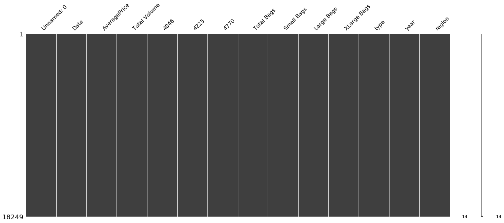

```python
conda install -c conda-forge/label/gcc7 missingno
```

    Collecting package metadata (current_repodata.json): done
    Solving environment: done
    
    # All requested packages already installed.
    
    
    Note: you may need to restart the kernel to use updated packages.


```python
import pandas as pd
import numpy as np
import missingno as msno
%matplotlib inline
```


```python
#https://www.kaggle.com/dgomonov/new-york-city-airbnb-open-data/metadata
path = 'AB_NYC_2019.csv'
df = pd.read_csv(path, encoding='latin', error_bad_lines=False)
df.head()
```


<div>
<style scoped>
    .dataframe tbody tr th:only-of-type {
        vertical-align: middle;
    }

    .dataframe tbody tr th {
        vertical-align: top;
    }

    .dataframe thead th {
        text-align: right;
    }
</style>
<table border="1" class="dataframe">
  <thead>
    <tr style="text-align: right;">
      <th></th>
      <th>id</th>
      <th>name</th>
      <th>host_id</th>
      <th>host_name</th>
      <th>neighbourhood_group</th>
      <th>neighbourhood</th>
      <th>latitude</th>
      <th>longitude</th>
      <th>room_type</th>
      <th>price</th>
      <th>minimum_nights</th>
      <th>number_of_reviews</th>
      <th>last_review</th>
      <th>reviews_per_month</th>
      <th>calculated_host_listings_count</th>
      <th>availability_365</th>
    </tr>
  </thead>
  <tbody>
    <tr>
      <td>0</td>
      <td>2539</td>
      <td>Clean &amp; quiet apt home by the park</td>
      <td>2787</td>
      <td>John</td>
      <td>Brooklyn</td>
      <td>Kensington</td>
      <td>40.64749</td>
      <td>-73.97237</td>
      <td>Private room</td>
      <td>149</td>
      <td>1</td>
      <td>9</td>
      <td>2018-10-19</td>
      <td>0.21</td>
      <td>6</td>
      <td>365</td>
    </tr>
    <tr>
      <td>1</td>
      <td>2595</td>
      <td>Skylit Midtown Castle</td>
      <td>2845</td>
      <td>Jennifer</td>
      <td>Manhattan</td>
      <td>Midtown</td>
      <td>40.75362</td>
      <td>-73.98377</td>
      <td>Entire home/apt</td>
      <td>225</td>
      <td>1</td>
      <td>45</td>
      <td>2019-05-21</td>
      <td>0.38</td>
      <td>2</td>
      <td>355</td>
    </tr>
    <tr>
      <td>2</td>
      <td>3647</td>
      <td>THE VILLAGE OF HARLEM....NEW YORK !</td>
      <td>4632</td>
      <td>Elisabeth</td>
      <td>Manhattan</td>
      <td>Harlem</td>
      <td>40.80902</td>
      <td>-73.94190</td>
      <td>Private room</td>
      <td>150</td>
      <td>3</td>
      <td>0</td>
      <td>NaN</td>
      <td>NaN</td>
      <td>1</td>
      <td>365</td>
    </tr>
    <tr>
      <td>3</td>
      <td>3831</td>
      <td>Cozy Entire Floor of Brownstone</td>
      <td>4869</td>
      <td>LisaRoxanne</td>
      <td>Brooklyn</td>
      <td>Clinton Hill</td>
      <td>40.68514</td>
      <td>-73.95976</td>
      <td>Entire home/apt</td>
      <td>89</td>
      <td>1</td>
      <td>270</td>
      <td>2019-07-05</td>
      <td>4.64</td>
      <td>1</td>
      <td>194</td>
    </tr>
    <tr>
      <td>4</td>
      <td>5022</td>
      <td>Entire Apt: Spacious Studio/Loft by central park</td>
      <td>7192</td>
      <td>Laura</td>
      <td>Manhattan</td>
      <td>East Harlem</td>
      <td>40.79851</td>
      <td>-73.94399</td>
      <td>Entire home/apt</td>
      <td>80</td>
      <td>10</td>
      <td>9</td>
      <td>2018-11-19</td>
      <td>0.10</td>
      <td>1</td>
      <td>0</td>
    </tr>
  </tbody>
</table>
</div>


```python
df.info()
```

    <class 'pandas.core.frame.DataFrame'>
    RangeIndex: 48895 entries, 0 to 48894
    Data columns (total 16 columns):
    id                                48895 non-null int64
    name                              48879 non-null object
    host_id                           48895 non-null int64
    host_name                         48874 non-null object
    neighbourhood_group               48895 non-null object
    neighbourhood                     48895 non-null object
    latitude                          48895 non-null float64
    longitude                         48895 non-null float64
    room_type                         48895 non-null object
    price                             48895 non-null int64
    minimum_nights                    48895 non-null int64
    number_of_reviews                 48895 non-null int64
    last_review                       38843 non-null object
    reviews_per_month                 38843 non-null float64
    calculated_host_listings_count    48895 non-null int64
    availability_365                  48895 non-null int64
    dtypes: float64(3), int64(7), object(6)
    memory usage: 6.0+ MB


```python
df.shape
```


    (48895, 16)


```python
df.shape[0]
```


    48895


```python
df.shape[1]
```


    16


```python
df.columns.values.tolist()
```


    ['id',
     'name',
     'host_id',
     'host_name',
     'neighbourhood_group',
     'neighbourhood',
     'latitude',
     'longitude',
     'room_type',
     'price',
     'minimum_nights',
     'number_of_reviews',
     'last_review',
     'reviews_per_month',
     'calculated_host_listings_count',
     'availability_365']


```python
df.dtypes
```


    id                                  int64
    name                               object
    host_id                             int64
    host_name                          object
    neighbourhood_group                object
    neighbourhood                      object
    latitude                          float64
    longitude                         float64
    room_type                          object
    price                               int64
    minimum_nights                      int64
    number_of_reviews                   int64
    last_review                        object
    reviews_per_month                 float64
    calculated_host_listings_count      int64
    availability_365                    int64
    dtype: object


```python
df.isnull().any().any()
```


    True


```python
msno.matrix(df)
```


    <matplotlib.axes._subplots.AxesSubplot at 0x7f495a95b090>





```python
df.replace({' ': np.nan}, inplace=True)
```


```python
df.isnull().any().any()
```


    True


```python
msno.matrix(df)
```


    <matplotlib.axes._subplots.AxesSubplot at 0x7f4957776690>


```python
msno.bar(df)
```


    <matplotlib.axes._subplots.AxesSubplot at 0x7f49599c6dd0>


```python
df.columns[df.isnull().any()].tolist()
```


    ['name', 'host_name', 'last_review', 'reviews_per_month']


```python
df.describe()
```


<div>
<style scoped>
    .dataframe tbody tr th:only-of-type {
        vertical-align: middle;
    }

    .dataframe tbody tr th {
        vertical-align: top;
    }

    .dataframe thead th {
        text-align: right;
    }
</style>
<table border="1" class="dataframe">
  <thead>
    <tr style="text-align: right;">
      <th></th>
      <th>id</th>
      <th>host_id</th>
      <th>latitude</th>
      <th>longitude</th>
      <th>price</th>
      <th>minimum_nights</th>
      <th>number_of_reviews</th>
      <th>reviews_per_month</th>
      <th>calculated_host_listings_count</th>
      <th>availability_365</th>
    </tr>
  </thead>
  <tbody>
    <tr>
      <td>count</td>
      <td>4.889500e+04</td>
      <td>4.889500e+04</td>
      <td>48895.000000</td>
      <td>48895.000000</td>
      <td>48895.000000</td>
      <td>48895.000000</td>
      <td>48895.000000</td>
      <td>38843.000000</td>
      <td>48895.000000</td>
      <td>48895.000000</td>
    </tr>
    <tr>
      <td>mean</td>
      <td>1.901714e+07</td>
      <td>6.762001e+07</td>
      <td>40.728949</td>
      <td>-73.952170</td>
      <td>152.720687</td>
      <td>7.029962</td>
      <td>23.274466</td>
      <td>1.373221</td>
      <td>7.143982</td>
      <td>112.781327</td>
    </tr>
    <tr>
      <td>std</td>
      <td>1.098311e+07</td>
      <td>7.861097e+07</td>
      <td>0.054530</td>
      <td>0.046157</td>
      <td>240.154170</td>
      <td>20.510550</td>
      <td>44.550582</td>
      <td>1.680442</td>
      <td>32.952519</td>
      <td>131.622289</td>
    </tr>
    <tr>
      <td>min</td>
      <td>2.539000e+03</td>
      <td>2.438000e+03</td>
      <td>40.499790</td>
      <td>-74.244420</td>
      <td>0.000000</td>
      <td>1.000000</td>
      <td>0.000000</td>
      <td>0.010000</td>
      <td>1.000000</td>
      <td>0.000000</td>
    </tr>
    <tr>
      <td>25%</td>
      <td>9.471945e+06</td>
      <td>7.822033e+06</td>
      <td>40.690100</td>
      <td>-73.983070</td>
      <td>69.000000</td>
      <td>1.000000</td>
      <td>1.000000</td>
      <td>0.190000</td>
      <td>1.000000</td>
      <td>0.000000</td>
    </tr>
    <tr>
      <td>50%</td>
      <td>1.967728e+07</td>
      <td>3.079382e+07</td>
      <td>40.723070</td>
      <td>-73.955680</td>
      <td>106.000000</td>
      <td>3.000000</td>
      <td>5.000000</td>
      <td>0.720000</td>
      <td>1.000000</td>
      <td>45.000000</td>
    </tr>
    <tr>
      <td>75%</td>
      <td>2.915218e+07</td>
      <td>1.074344e+08</td>
      <td>40.763115</td>
      <td>-73.936275</td>
      <td>175.000000</td>
      <td>5.000000</td>
      <td>24.000000</td>
      <td>2.020000</td>
      <td>2.000000</td>
      <td>227.000000</td>
    </tr>
    <tr>
      <td>max</td>
      <td>3.648724e+07</td>
      <td>2.743213e+08</td>
      <td>40.913060</td>
      <td>-73.712990</td>
      <td>10000.000000</td>
      <td>1250.000000</td>
      <td>629.000000</td>
      <td>58.500000</td>
      <td>327.000000</td>
      <td>365.000000</td>
    </tr>
  </tbody>
</table>
</div>


```python
df.loc[[0]]
```


<div>
<style scoped>
    .dataframe tbody tr th:only-of-type {
        vertical-align: middle;
    }

    .dataframe tbody tr th {
        vertical-align: top;
    }

    .dataframe thead th {
        text-align: right;
    }
</style>
<table border="1" class="dataframe">
  <thead>
    <tr style="text-align: right;">
      <th></th>
      <th>id</th>
      <th>name</th>
      <th>host_id</th>
      <th>host_name</th>
      <th>neighbourhood_group</th>
      <th>neighbourhood</th>
      <th>latitude</th>
      <th>longitude</th>
      <th>room_type</th>
      <th>price</th>
      <th>minimum_nights</th>
      <th>number_of_reviews</th>
      <th>last_review</th>
      <th>reviews_per_month</th>
      <th>calculated_host_listings_count</th>
      <th>availability_365</th>
    </tr>
  </thead>
  <tbody>
    <tr>
      <td>0</td>
      <td>2539</td>
      <td>Clean &amp; quiet apt home by the park</td>
      <td>2787</td>
      <td>John</td>
      <td>Brooklyn</td>
      <td>Kensington</td>
      <td>40.64749</td>
      <td>-73.97237</td>
      <td>Private room</td>
      <td>149</td>
      <td>1</td>
      <td>9</td>
      <td>2018-10-19</td>
      <td>0.21</td>
      <td>6</td>
      <td>365</td>
    </tr>
  </tbody>
</table>
</div>


```python
df.loc[30:33]
```


<div>
<style scoped>
    .dataframe tbody tr th:only-of-type {
        vertical-align: middle;
    }

    .dataframe tbody tr th {
        vertical-align: top;
    }

    .dataframe thead th {
        text-align: right;
    }
</style>
<table border="1" class="dataframe">
  <thead>
    <tr style="text-align: right;">
      <th></th>
      <th>id</th>
      <th>name</th>
      <th>host_id</th>
      <th>host_name</th>
      <th>neighbourhood_group</th>
      <th>neighbourhood</th>
      <th>latitude</th>
      <th>longitude</th>
      <th>room_type</th>
      <th>price</th>
      <th>minimum_nights</th>
      <th>number_of_reviews</th>
      <th>last_review</th>
      <th>reviews_per_month</th>
      <th>calculated_host_listings_count</th>
      <th>availability_365</th>
    </tr>
  </thead>
  <tbody>
    <tr>
      <td>30</td>
      <td>9668</td>
      <td>front room/double bed</td>
      <td>32294</td>
      <td>Ssameer Or Trip</td>
      <td>Manhattan</td>
      <td>Harlem</td>
      <td>40.82245</td>
      <td>-73.95104</td>
      <td>Private room</td>
      <td>50</td>
      <td>3</td>
      <td>242</td>
      <td>2019-06-01</td>
      <td>2.04</td>
      <td>3</td>
      <td>355</td>
    </tr>
    <tr>
      <td>31</td>
      <td>9704</td>
      <td>Spacious 1 bedroom in luxe building</td>
      <td>32045</td>
      <td>Teri</td>
      <td>Manhattan</td>
      <td>Harlem</td>
      <td>40.81305</td>
      <td>-73.95466</td>
      <td>Private room</td>
      <td>52</td>
      <td>2</td>
      <td>88</td>
      <td>2019-06-14</td>
      <td>1.42</td>
      <td>1</td>
      <td>255</td>
    </tr>
    <tr>
      <td>32</td>
      <td>9782</td>
      <td>Loft in Williamsburg Area w/ Roof</td>
      <td>32169</td>
      <td>Andrea</td>
      <td>Brooklyn</td>
      <td>Greenpoint</td>
      <td>40.72219</td>
      <td>-73.93762</td>
      <td>Private room</td>
      <td>55</td>
      <td>4</td>
      <td>197</td>
      <td>2019-06-15</td>
      <td>1.65</td>
      <td>3</td>
      <td>284</td>
    </tr>
    <tr>
      <td>33</td>
      <td>9783</td>
      <td>back room/bunk beds</td>
      <td>32294</td>
      <td>Ssameer Or Trip</td>
      <td>Manhattan</td>
      <td>Harlem</td>
      <td>40.82130</td>
      <td>-73.95318</td>
      <td>Private room</td>
      <td>50</td>
      <td>3</td>
      <td>273</td>
      <td>2019-07-01</td>
      <td>2.37</td>
      <td>3</td>
      <td>359</td>
    </tr>
  </tbody>
</table>
</div>


```python
df.drop([0,24,51], axis=0).head()
```


<div>
<style scoped>
    .dataframe tbody tr th:only-of-type {
        vertical-align: middle;
    }

    .dataframe tbody tr th {
        vertical-align: top;
    }

    .dataframe thead th {
        text-align: right;
    }
</style>
<table border="1" class="dataframe">
  <thead>
    <tr style="text-align: right;">
      <th></th>
      <th>id</th>
      <th>name</th>
      <th>host_id</th>
      <th>host_name</th>
      <th>neighbourhood_group</th>
      <th>neighbourhood</th>
      <th>latitude</th>
      <th>longitude</th>
      <th>room_type</th>
      <th>price</th>
      <th>minimum_nights</th>
      <th>number_of_reviews</th>
      <th>last_review</th>
      <th>reviews_per_month</th>
      <th>calculated_host_listings_count</th>
      <th>availability_365</th>
    </tr>
  </thead>
  <tbody>
    <tr>
      <td>1</td>
      <td>2595</td>
      <td>Skylit Midtown Castle</td>
      <td>2845</td>
      <td>Jennifer</td>
      <td>Manhattan</td>
      <td>Midtown</td>
      <td>40.75362</td>
      <td>-73.98377</td>
      <td>Entire home/apt</td>
      <td>225</td>
      <td>1</td>
      <td>45</td>
      <td>2019-05-21</td>
      <td>0.38</td>
      <td>2</td>
      <td>355</td>
    </tr>
    <tr>
      <td>2</td>
      <td>3647</td>
      <td>THE VILLAGE OF HARLEM....NEW YORK !</td>
      <td>4632</td>
      <td>Elisabeth</td>
      <td>Manhattan</td>
      <td>Harlem</td>
      <td>40.80902</td>
      <td>-73.94190</td>
      <td>Private room</td>
      <td>150</td>
      <td>3</td>
      <td>0</td>
      <td>NaN</td>
      <td>NaN</td>
      <td>1</td>
      <td>365</td>
    </tr>
    <tr>
      <td>3</td>
      <td>3831</td>
      <td>Cozy Entire Floor of Brownstone</td>
      <td>4869</td>
      <td>LisaRoxanne</td>
      <td>Brooklyn</td>
      <td>Clinton Hill</td>
      <td>40.68514</td>
      <td>-73.95976</td>
      <td>Entire home/apt</td>
      <td>89</td>
      <td>1</td>
      <td>270</td>
      <td>2019-07-05</td>
      <td>4.64</td>
      <td>1</td>
      <td>194</td>
    </tr>
    <tr>
      <td>4</td>
      <td>5022</td>
      <td>Entire Apt: Spacious Studio/Loft by central park</td>
      <td>7192</td>
      <td>Laura</td>
      <td>Manhattan</td>
      <td>East Harlem</td>
      <td>40.79851</td>
      <td>-73.94399</td>
      <td>Entire home/apt</td>
      <td>80</td>
      <td>10</td>
      <td>9</td>
      <td>2018-11-19</td>
      <td>0.10</td>
      <td>1</td>
      <td>0</td>
    </tr>
    <tr>
      <td>5</td>
      <td>5099</td>
      <td>Large Cozy 1 BR Apartment In Midtown East</td>
      <td>7322</td>
      <td>Chris</td>
      <td>Manhattan</td>
      <td>Murray Hill</td>
      <td>40.74767</td>
      <td>-73.97500</td>
      <td>Entire home/apt</td>
      <td>200</td>
      <td>3</td>
      <td>74</td>
      <td>2019-06-22</td>
      <td>0.59</td>
      <td>1</td>
      <td>129</td>
    </tr>
  </tbody>
</table>
</div>


```python
df.drop(df.index[1:5], axis=0).head(10)
```


<div>
<style scoped>
    .dataframe tbody tr th:only-of-type {
        vertical-align: middle;
    }

    .dataframe tbody tr th {
        vertical-align: top;
    }

    .dataframe thead th {
        text-align: right;
    }
</style>
<table border="1" class="dataframe">
  <thead>
    <tr style="text-align: right;">
      <th></th>
      <th>id</th>
      <th>name</th>
      <th>host_id</th>
      <th>host_name</th>
      <th>neighbourhood_group</th>
      <th>neighbourhood</th>
      <th>latitude</th>
      <th>longitude</th>
      <th>room_type</th>
      <th>price</th>
      <th>minimum_nights</th>
      <th>number_of_reviews</th>
      <th>last_review</th>
      <th>reviews_per_month</th>
      <th>calculated_host_listings_count</th>
      <th>availability_365</th>
    </tr>
  </thead>
  <tbody>
    <tr>
      <td>0</td>
      <td>2539</td>
      <td>Clean &amp; quiet apt home by the park</td>
      <td>2787</td>
      <td>John</td>
      <td>Brooklyn</td>
      <td>Kensington</td>
      <td>40.64749</td>
      <td>-73.97237</td>
      <td>Private room</td>
      <td>149</td>
      <td>1</td>
      <td>9</td>
      <td>2018-10-19</td>
      <td>0.21</td>
      <td>6</td>
      <td>365</td>
    </tr>
    <tr>
      <td>5</td>
      <td>5099</td>
      <td>Large Cozy 1 BR Apartment In Midtown East</td>
      <td>7322</td>
      <td>Chris</td>
      <td>Manhattan</td>
      <td>Murray Hill</td>
      <td>40.74767</td>
      <td>-73.97500</td>
      <td>Entire home/apt</td>
      <td>200</td>
      <td>3</td>
      <td>74</td>
      <td>2019-06-22</td>
      <td>0.59</td>
      <td>1</td>
      <td>129</td>
    </tr>
    <tr>
      <td>6</td>
      <td>5121</td>
      <td>BlissArtsSpace!</td>
      <td>7356</td>
      <td>Garon</td>
      <td>Brooklyn</td>
      <td>Bedford-Stuyvesant</td>
      <td>40.68688</td>
      <td>-73.95596</td>
      <td>Private room</td>
      <td>60</td>
      <td>45</td>
      <td>49</td>
      <td>2017-10-05</td>
      <td>0.40</td>
      <td>1</td>
      <td>0</td>
    </tr>
    <tr>
      <td>7</td>
      <td>5178</td>
      <td>Large Furnished Room Near B'way</td>
      <td>8967</td>
      <td>Shunichi</td>
      <td>Manhattan</td>
      <td>Hell's Kitchen</td>
      <td>40.76489</td>
      <td>-73.98493</td>
      <td>Private room</td>
      <td>79</td>
      <td>2</td>
      <td>430</td>
      <td>2019-06-24</td>
      <td>3.47</td>
      <td>1</td>
      <td>220</td>
    </tr>
    <tr>
      <td>8</td>
      <td>5203</td>
      <td>Cozy Clean Guest Room - Family Apt</td>
      <td>7490</td>
      <td>MaryEllen</td>
      <td>Manhattan</td>
      <td>Upper West Side</td>
      <td>40.80178</td>
      <td>-73.96723</td>
      <td>Private room</td>
      <td>79</td>
      <td>2</td>
      <td>118</td>
      <td>2017-07-21</td>
      <td>0.99</td>
      <td>1</td>
      <td>0</td>
    </tr>
    <tr>
      <td>9</td>
      <td>5238</td>
      <td>Cute &amp; Cozy Lower East Side 1 bdrm</td>
      <td>7549</td>
      <td>Ben</td>
      <td>Manhattan</td>
      <td>Chinatown</td>
      <td>40.71344</td>
      <td>-73.99037</td>
      <td>Entire home/apt</td>
      <td>150</td>
      <td>1</td>
      <td>160</td>
      <td>2019-06-09</td>
      <td>1.33</td>
      <td>4</td>
      <td>188</td>
    </tr>
    <tr>
      <td>10</td>
      <td>5295</td>
      <td>Beautiful 1br on Upper West Side</td>
      <td>7702</td>
      <td>Lena</td>
      <td>Manhattan</td>
      <td>Upper West Side</td>
      <td>40.80316</td>
      <td>-73.96545</td>
      <td>Entire home/apt</td>
      <td>135</td>
      <td>5</td>
      <td>53</td>
      <td>2019-06-22</td>
      <td>0.43</td>
      <td>1</td>
      <td>6</td>
    </tr>
    <tr>
      <td>11</td>
      <td>5441</td>
      <td>Central Manhattan/near Broadway</td>
      <td>7989</td>
      <td>Kate</td>
      <td>Manhattan</td>
      <td>Hell's Kitchen</td>
      <td>40.76076</td>
      <td>-73.98867</td>
      <td>Private room</td>
      <td>85</td>
      <td>2</td>
      <td>188</td>
      <td>2019-06-23</td>
      <td>1.50</td>
      <td>1</td>
      <td>39</td>
    </tr>
    <tr>
      <td>12</td>
      <td>5803</td>
      <td>Lovely Room 1, Garden, Best Area, Legal rental</td>
      <td>9744</td>
      <td>Laurie</td>
      <td>Brooklyn</td>
      <td>South Slope</td>
      <td>40.66829</td>
      <td>-73.98779</td>
      <td>Private room</td>
      <td>89</td>
      <td>4</td>
      <td>167</td>
      <td>2019-06-24</td>
      <td>1.34</td>
      <td>3</td>
      <td>314</td>
    </tr>
    <tr>
      <td>13</td>
      <td>6021</td>
      <td>Wonderful Guest Bedroom in Manhattan for SINGLES</td>
      <td>11528</td>
      <td>Claudio</td>
      <td>Manhattan</td>
      <td>Upper West Side</td>
      <td>40.79826</td>
      <td>-73.96113</td>
      <td>Private room</td>
      <td>85</td>
      <td>2</td>
      <td>113</td>
      <td>2019-07-05</td>
      <td>0.91</td>
      <td>1</td>
      <td>333</td>
    </tr>
  </tbody>
</table>
</div>


```python
df[100:].head() #df.tail(-100) )
```


<div>
<style scoped>
    .dataframe tbody tr th:only-of-type {
        vertical-align: middle;
    }

    .dataframe tbody tr th {
        vertical-align: top;
    }

    .dataframe thead th {
        text-align: right;
    }
</style>
<table border="1" class="dataframe">
  <thead>
    <tr style="text-align: right;">
      <th></th>
      <th>id</th>
      <th>name</th>
      <th>host_id</th>
      <th>host_name</th>
      <th>neighbourhood_group</th>
      <th>neighbourhood</th>
      <th>latitude</th>
      <th>longitude</th>
      <th>room_type</th>
      <th>price</th>
      <th>minimum_nights</th>
      <th>number_of_reviews</th>
      <th>last_review</th>
      <th>reviews_per_month</th>
      <th>calculated_host_listings_count</th>
      <th>availability_365</th>
    </tr>
  </thead>
  <tbody>
    <tr>
      <td>100</td>
      <td>22918</td>
      <td>loft bed - near transportation-15min to times sq</td>
      <td>32294</td>
      <td>Ssameer Or Trip</td>
      <td>Manhattan</td>
      <td>Harlem</td>
      <td>40.82279</td>
      <td>-73.95139</td>
      <td>Private room</td>
      <td>60</td>
      <td>3</td>
      <td>11</td>
      <td>2019-01-03</td>
      <td>0.87</td>
      <td>3</td>
      <td>219</td>
    </tr>
    <tr>
      <td>101</td>
      <td>23135</td>
      <td>House On Henry (3rd FLR Suite)</td>
      <td>11481</td>
      <td>Annette</td>
      <td>Brooklyn</td>
      <td>Carroll Gardens</td>
      <td>40.67967</td>
      <td>-74.00154</td>
      <td>Entire home/apt</td>
      <td>175</td>
      <td>2</td>
      <td>233</td>
      <td>2019-06-24</td>
      <td>2.09</td>
      <td>3</td>
      <td>342</td>
    </tr>
    <tr>
      <td>102</td>
      <td>23501</td>
      <td>Monkey Retreat Manhattan</td>
      <td>63318</td>
      <td>Meka</td>
      <td>Manhattan</td>
      <td>Washington Heights</td>
      <td>40.83927</td>
      <td>-73.94281</td>
      <td>Private room</td>
      <td>65</td>
      <td>2</td>
      <td>68</td>
      <td>2012-11-01</td>
      <td>0.60</td>
      <td>1</td>
      <td>312</td>
    </tr>
    <tr>
      <td>103</td>
      <td>23686</td>
      <td>2000 SF 3br 2bath West Village private  townhouse</td>
      <td>93790</td>
      <td>Ann</td>
      <td>Manhattan</td>
      <td>West Village</td>
      <td>40.73096</td>
      <td>-74.00319</td>
      <td>Entire home/apt</td>
      <td>500</td>
      <td>4</td>
      <td>46</td>
      <td>2019-05-18</td>
      <td>0.55</td>
      <td>2</td>
      <td>243</td>
    </tr>
    <tr>
      <td>104</td>
      <td>24143</td>
      <td>Williamsburg—Steps To Subway, Private Bath&amp;B...</td>
      <td>97219</td>
      <td>Seth</td>
      <td>Brooklyn</td>
      <td>Williamsburg</td>
      <td>40.71332</td>
      <td>-73.94177</td>
      <td>Private room</td>
      <td>101</td>
      <td>3</td>
      <td>335</td>
      <td>2019-05-29</td>
      <td>3.02</td>
      <td>1</td>
      <td>152</td>
    </tr>
  </tbody>
</table>
</div>


```python
df.price.values
```


    array([149, 225, 150, ..., 115,  55,  90])


```python
df['price'].values
```


    array([149, 225, 150, ..., 115,  55,  90])


```python
df.price.unique()
```


    array([  149,   225,   150,    89,    80,   200,    60,    79,   135,
              85,   120,   140,   215,    99,   190,   299,   130,   110,
              44,   180,    50,    52,    55,    70,    35,    40,    68,
             115,   151,   228,   144,    69,    49,   375,   250,   275,
             230,    51,    65,   105,    95,   145,   285,    94,   800,
             131,    98,   100,   125,   175,   500,   101,   220,    59,
             350,   199,   325,   235,   170,   400,    75,    90,   185,
              77,    76,   160,   195,   156,   219,   475,   165,   196,
              83,   123,   265,   249,   121,    45,    71,    64,   159,
             189,   239,   305,   155,    92,    36,    37,   205,    39,
             390,   129,   212,   124,   122,   109,   575,   229,   169,
             113,   179,   349,   139,   650,    67,   599,   211,   290,
              87,   395,   260,    97,   132,   141,   495,   259,    96,
             295,   451,   300,    42,   255,    72,    88,   450,   198,
              46,    33,   106,    91,  2000,   429,   107,    43,   248,
              41,   157,   172,   146,   116,   288,   270,   241,   399,
             438,   279,   137,   280,   226,   154,   700,   246,   119,
             850,    81,    54,   760,    48,    58,   153,    73,   485,
             310,   167,   147,    34,    93,    56,  1300,   127,   402,
              30,   240,   385,    47,   209,   192,    86,   245,   499,
             387,   178,  3000,   549,    20,    74,   104,   298,   269,
             138,   208,   142,   174,   315,   210,   311,    82,   117,
             380,   328,   102,   118,   217,   152,   197,   133,   331,
             128,   136,   148,  1000,   263,   433,    61,   234,   595,
             108,   355,   134,    62,   550,    84,    78,   900,   103,
             330,   425,   168,    66,   625,   171,   187,   600,   312,
              38,   163,   158,   173,   465,    63,   340,    57,  4000,
             999,   289,   166,   176,   339,   191,  2500,   329,   890,
              53,   420,   950,   334,  1395,   221,   182,   750,   181,
             112,  1500,  1899,   188,   262,   111,   162,    29,   232,
            5000,   345,  1100,   224,    10,   194,    31,  1200,   440,
             439,   555,   143,   184,   799,   455,   193,   161,   201,
            1700,   525,    32,   251,  1999,   480,   320,   164,   272,
             177,   560,  6000,   379,   303,   675,   749,  5250,  1550,
            1250,  1485,   369,  6500,  2750,  3750,  1600,   975,    25,
              18,  2300,   409,   218,   430,  4500,  8000,   795,   414,
             126,    16,   785,   370,    22,   316,   264,   318,   273,
             308,   365,   216,   545,   860,   540,   233,  1400,   383,
             419,  1050,  2695,   985,   360,   699,   227,   247,   895,
            9999,   258,  2400,   254,   346,   415,   995,  1763,   510,
            1450,   281,    27,    28,   825,   524,   202,   244,   114,
             341,   257,   322,   276,   207,   445,   284,   449,   680,
            1495,   256,   888,   389,   460, 10000,   222,   243,   267,
             398,   386,   319,   238,   374,   490,   335,  1195,   203,
             469,   186,   352,   297,   237,   745,   410,  1170,   261,
            1150,   434,   590,   899,   304,   296,   183,   531,   214,
             655,    24,   477,   372,   206,    26,   587,   204,  1731,
            1002,   333,   283,   814,  1800,   278,   421,   690,   619,
            2100,   348,   223,   268,   359,   436,   935,   274,   376,
             980,   294,   559,   509,   301,   408,  3800,   479,  2350,
             822,    23,   407,   489,   252,   672,   378,   584,   894,
             643,   462,   649,   302,   321,   534,   748,   487,   236,
            1020,    19,  1599,    21,   585,  2590,    11,   640,   459,
              12,  2250,   484,   337,   317,    15,  2800,  1475,   615,
            2900,   287,     0,   515,  1067,   424,   578,   789,  1795,
            1095,   530,  3900,   496,   435,   422,   367,   695,  1177,
             790,   253,   573,   766,   231,   840,   577,   589,   949,
             358,   213,  2200,   497,  1066,   412,   647,   277,   720,
            2010,  3210,  4160,  1046,   271,   416,  1680,  7703,  3518,
            6419,  2626,  2103,  8500,  2990,   620,   394,   323,   974,
             344,  1333,   780,   347,   393,   309,   483,   737,   470,
             689,   639,   848,   403,   471,   377,   282,   314,   478,
             670,  2545,  1115,   520,   913,   505,   718,   692,  3600,
             307,   306,  1880,   714,   956,   266,   292,  2999,   418,
             452,   397,   343,   291,   392,   356,   242,   396,   332,
             361,   453,   481,   466,   388,   423,   362,   313,   805,
             725,   443,  1350,  3200,   293,   432,   444,  1075,   820,
             373,  1750,  1080,  1299,  1295,   519,  1978,  1494,  3512,
             382,   404,   503,   472,   454,   431,   468,   498,   612,
             488,  1497,  2850,   990,   506,   324,  1315,   446,  7500,
            3613,  2600,  4100,   794,  1145,  1306,   336,  5100,   898,
             327,   442,   474,  1799,   353,  4200,   616,  6800,   945,
             539,   426,   875,   463,   688,   580,   583,   381,  1900,
             659,   830,    13,   447,  1099,   428,   920,   930,  2995,
             342,   843,   417,  1308,   561,  1369,  1749,   338])


```python
df.price.value_counts()
```


    100     2051
    150     2047
    50      1534
    60      1458
    200     1401
            ... 
    463        1
    266        1
    453        1
    1306       1
    1749       1
    Name: price, Length: 674, dtype: int64


```python
df.agg(['count', 'size', 'nunique'])
```


<div>
<style scoped>
    .dataframe tbody tr th:only-of-type {
        vertical-align: middle;
    }

    .dataframe tbody tr th {
        vertical-align: top;
    }

    .dataframe thead th {
        text-align: right;
    }
</style>
<table border="1" class="dataframe">
  <thead>
    <tr style="text-align: right;">
      <th></th>
      <th>id</th>
      <th>name</th>
      <th>host_id</th>
      <th>host_name</th>
      <th>neighbourhood_group</th>
      <th>neighbourhood</th>
      <th>latitude</th>
      <th>longitude</th>
      <th>room_type</th>
      <th>price</th>
      <th>minimum_nights</th>
      <th>number_of_reviews</th>
      <th>last_review</th>
      <th>reviews_per_month</th>
      <th>calculated_host_listings_count</th>
      <th>availability_365</th>
    </tr>
  </thead>
  <tbody>
    <tr>
      <td>count</td>
      <td>48895</td>
      <td>48879</td>
      <td>48895</td>
      <td>48874</td>
      <td>48895</td>
      <td>48895</td>
      <td>48895</td>
      <td>48895</td>
      <td>48895</td>
      <td>48895</td>
      <td>48895</td>
      <td>48895</td>
      <td>38843</td>
      <td>38843</td>
      <td>48895</td>
      <td>48895</td>
    </tr>
    <tr>
      <td>size</td>
      <td>48895</td>
      <td>48895</td>
      <td>48895</td>
      <td>48895</td>
      <td>48895</td>
      <td>48895</td>
      <td>48895</td>
      <td>48895</td>
      <td>48895</td>
      <td>48895</td>
      <td>48895</td>
      <td>48895</td>
      <td>48895</td>
      <td>48895</td>
      <td>48895</td>
      <td>48895</td>
    </tr>
    <tr>
      <td>nunique</td>
      <td>48895</td>
      <td>47905</td>
      <td>37457</td>
      <td>11452</td>
      <td>5</td>
      <td>221</td>
      <td>19048</td>
      <td>14718</td>
      <td>3</td>
      <td>674</td>
      <td>109</td>
      <td>394</td>
      <td>1764</td>
      <td>937</td>
      <td>47</td>
      <td>366</td>
    </tr>
  </tbody>
</table>
</div>


```python
df.groupby('price').agg(['count', 'size', 'nunique']).stack()
```


<div>
<style scoped>
    .dataframe tbody tr th:only-of-type {
        vertical-align: middle;
    }

    .dataframe tbody tr th {
        vertical-align: top;
    }

    .dataframe thead th {
        text-align: right;
    }
</style>
<table border="1" class="dataframe">
  <thead>
    <tr style="text-align: right;">
      <th></th>
      <th></th>
      <th>id</th>
      <th>name</th>
      <th>host_id</th>
      <th>host_name</th>
      <th>neighbourhood_group</th>
      <th>neighbourhood</th>
      <th>latitude</th>
      <th>longitude</th>
      <th>room_type</th>
      <th>minimum_nights</th>
      <th>number_of_reviews</th>
      <th>last_review</th>
      <th>reviews_per_month</th>
      <th>calculated_host_listings_count</th>
      <th>availability_365</th>
    </tr>
    <tr>
      <th>price</th>
      <th></th>
      <th></th>
      <th></th>
      <th></th>
      <th></th>
      <th></th>
      <th></th>
      <th></th>
      <th></th>
      <th></th>
      <th></th>
      <th></th>
      <th></th>
      <th></th>
      <th></th>
      <th></th>
    </tr>
  </thead>
  <tbody>
    <tr>
      <td rowspan="3" valign="top">0</td>
      <td>count</td>
      <td>11</td>
      <td>11</td>
      <td>11</td>
      <td>11</td>
      <td>11</td>
      <td>11</td>
      <td>11</td>
      <td>11</td>
      <td>11</td>
      <td>11</td>
      <td>11</td>
      <td>10</td>
      <td>10</td>
      <td>11</td>
      <td>11</td>
    </tr>
    <tr>
      <td>size</td>
      <td>11</td>
      <td>11</td>
      <td>11</td>
      <td>11</td>
      <td>11</td>
      <td>11</td>
      <td>11</td>
      <td>11</td>
      <td>11</td>
      <td>11</td>
      <td>11</td>
      <td>11</td>
      <td>11</td>
      <td>11</td>
      <td>11</td>
    </tr>
    <tr>
      <td>nunique</td>
      <td>11</td>
      <td>11</td>
      <td>8</td>
      <td>8</td>
      <td>3</td>
      <td>6</td>
      <td>11</td>
      <td>11</td>
      <td>3</td>
      <td>6</td>
      <td>10</td>
      <td>10</td>
      <td>10</td>
      <td>5</td>
      <td>9</td>
    </tr>
    <tr>
      <td rowspan="2" valign="top">10</td>
      <td>count</td>
      <td>17</td>
      <td>17</td>
      <td>17</td>
      <td>17</td>
      <td>17</td>
      <td>17</td>
      <td>17</td>
      <td>17</td>
      <td>17</td>
      <td>17</td>
      <td>17</td>
      <td>12</td>
      <td>12</td>
      <td>17</td>
      <td>17</td>
    </tr>
    <tr>
      <td>size</td>
      <td>17</td>
      <td>17</td>
      <td>17</td>
      <td>17</td>
      <td>17</td>
      <td>17</td>
      <td>17</td>
      <td>17</td>
      <td>17</td>
      <td>17</td>
      <td>17</td>
      <td>17</td>
      <td>17</td>
      <td>17</td>
      <td>17</td>
    </tr>
    <tr>
      <td>...</td>
      <td>...</td>
      <td>...</td>
      <td>...</td>
      <td>...</td>
      <td>...</td>
      <td>...</td>
      <td>...</td>
      <td>...</td>
      <td>...</td>
      <td>...</td>
      <td>...</td>
      <td>...</td>
      <td>...</td>
      <td>...</td>
      <td>...</td>
      <td>...</td>
    </tr>
    <tr>
      <td rowspan="2" valign="top">9999</td>
      <td>size</td>
      <td>3</td>
      <td>3</td>
      <td>3</td>
      <td>3</td>
      <td>3</td>
      <td>3</td>
      <td>3</td>
      <td>3</td>
      <td>3</td>
      <td>3</td>
      <td>3</td>
      <td>3</td>
      <td>3</td>
      <td>3</td>
      <td>3</td>
    </tr>
    <tr>
      <td>nunique</td>
      <td>3</td>
      <td>3</td>
      <td>3</td>
      <td>3</td>
      <td>1</td>
      <td>2</td>
      <td>3</td>
      <td>3</td>
      <td>2</td>
      <td>3</td>
      <td>3</td>
      <td>2</td>
      <td>2</td>
      <td>1</td>
      <td>3</td>
    </tr>
    <tr>
      <td rowspan="3" valign="top">10000</td>
      <td>count</td>
      <td>3</td>
      <td>3</td>
      <td>3</td>
      <td>3</td>
      <td>3</td>
      <td>3</td>
      <td>3</td>
      <td>3</td>
      <td>3</td>
      <td>3</td>
      <td>3</td>
      <td>2</td>
      <td>2</td>
      <td>3</td>
      <td>3</td>
    </tr>
    <tr>
      <td>size</td>
      <td>3</td>
      <td>3</td>
      <td>3</td>
      <td>3</td>
      <td>3</td>
      <td>3</td>
      <td>3</td>
      <td>3</td>
      <td>3</td>
      <td>3</td>
      <td>3</td>
      <td>3</td>
      <td>3</td>
      <td>3</td>
      <td>3</td>
    </tr>
    <tr>
      <td>nunique</td>
      <td>3</td>
      <td>3</td>
      <td>3</td>
      <td>3</td>
      <td>3</td>
      <td>3</td>
      <td>3</td>
      <td>3</td>
      <td>2</td>
      <td>3</td>
      <td>3</td>
      <td>2</td>
      <td>2</td>
      <td>1</td>
      <td>2</td>
    </tr>
  </tbody>
</table>
<p>2022 rows × 15 columns</p>
</div>


```python
df.groupby('price').agg(['count', 'size', 'nunique'])
```


<div>
<style scoped>
    .dataframe tbody tr th:only-of-type {
        vertical-align: middle;
    }

    .dataframe tbody tr th {
        vertical-align: top;
    }

    .dataframe thead tr th {
        text-align: left;
    }

    .dataframe thead tr:last-of-type th {
        text-align: right;
    }
</style>
<table border="1" class="dataframe">
  <thead>
    <tr>
      <th></th>
      <th colspan="3" halign="left">id</th>
      <th colspan="3" halign="left">name</th>
      <th colspan="3" halign="left">host_id</th>
      <th>host_name</th>
      <th>...</th>
      <th>last_review</th>
      <th colspan="3" halign="left">reviews_per_month</th>
      <th colspan="3" halign="left">calculated_host_listings_count</th>
      <th colspan="3" halign="left">availability_365</th>
    </tr>
    <tr>
      <th></th>
      <th>count</th>
      <th>size</th>
      <th>nunique</th>
      <th>count</th>
      <th>size</th>
      <th>nunique</th>
      <th>count</th>
      <th>size</th>
      <th>nunique</th>
      <th>count</th>
      <th>...</th>
      <th>nunique</th>
      <th>count</th>
      <th>size</th>
      <th>nunique</th>
      <th>count</th>
      <th>size</th>
      <th>nunique</th>
      <th>count</th>
      <th>size</th>
      <th>nunique</th>
    </tr>
    <tr>
      <th>price</th>
      <th></th>
      <th></th>
      <th></th>
      <th></th>
      <th></th>
      <th></th>
      <th></th>
      <th></th>
      <th></th>
      <th></th>
      <th></th>
      <th></th>
      <th></th>
      <th></th>
      <th></th>
      <th></th>
      <th></th>
      <th></th>
      <th></th>
      <th></th>
      <th></th>
    </tr>
  </thead>
  <tbody>
    <tr>
      <td>0</td>
      <td>11</td>
      <td>11</td>
      <td>11</td>
      <td>11</td>
      <td>11</td>
      <td>11</td>
      <td>11</td>
      <td>11</td>
      <td>8</td>
      <td>11</td>
      <td>...</td>
      <td>10</td>
      <td>10</td>
      <td>11</td>
      <td>10</td>
      <td>11</td>
      <td>11</td>
      <td>5</td>
      <td>11</td>
      <td>11</td>
      <td>9</td>
    </tr>
    <tr>
      <td>10</td>
      <td>17</td>
      <td>17</td>
      <td>17</td>
      <td>17</td>
      <td>17</td>
      <td>17</td>
      <td>17</td>
      <td>17</td>
      <td>17</td>
      <td>17</td>
      <td>...</td>
      <td>12</td>
      <td>12</td>
      <td>17</td>
      <td>12</td>
      <td>17</td>
      <td>17</td>
      <td>3</td>
      <td>17</td>
      <td>17</td>
      <td>9</td>
    </tr>
    <tr>
      <td>11</td>
      <td>3</td>
      <td>3</td>
      <td>3</td>
      <td>3</td>
      <td>3</td>
      <td>3</td>
      <td>3</td>
      <td>3</td>
      <td>3</td>
      <td>3</td>
      <td>...</td>
      <td>1</td>
      <td>1</td>
      <td>3</td>
      <td>1</td>
      <td>3</td>
      <td>3</td>
      <td>1</td>
      <td>3</td>
      <td>3</td>
      <td>3</td>
    </tr>
    <tr>
      <td>12</td>
      <td>4</td>
      <td>4</td>
      <td>4</td>
      <td>4</td>
      <td>4</td>
      <td>4</td>
      <td>4</td>
      <td>4</td>
      <td>4</td>
      <td>4</td>
      <td>...</td>
      <td>1</td>
      <td>1</td>
      <td>4</td>
      <td>1</td>
      <td>4</td>
      <td>4</td>
      <td>1</td>
      <td>4</td>
      <td>4</td>
      <td>3</td>
    </tr>
    <tr>
      <td>13</td>
      <td>1</td>
      <td>1</td>
      <td>1</td>
      <td>1</td>
      <td>1</td>
      <td>1</td>
      <td>1</td>
      <td>1</td>
      <td>1</td>
      <td>1</td>
      <td>...</td>
      <td>1</td>
      <td>1</td>
      <td>1</td>
      <td>1</td>
      <td>1</td>
      <td>1</td>
      <td>1</td>
      <td>1</td>
      <td>1</td>
      <td>1</td>
    </tr>
    <tr>
      <td>...</td>
      <td>...</td>
      <td>...</td>
      <td>...</td>
      <td>...</td>
      <td>...</td>
      <td>...</td>
      <td>...</td>
      <td>...</td>
      <td>...</td>
      <td>...</td>
      <td>...</td>
      <td>...</td>
      <td>...</td>
      <td>...</td>
      <td>...</td>
      <td>...</td>
      <td>...</td>
      <td>...</td>
      <td>...</td>
      <td>...</td>
      <td>...</td>
    </tr>
    <tr>
      <td>7703</td>
      <td>1</td>
      <td>1</td>
      <td>1</td>
      <td>1</td>
      <td>1</td>
      <td>1</td>
      <td>1</td>
      <td>1</td>
      <td>1</td>
      <td>1</td>
      <td>...</td>
      <td>0</td>
      <td>0</td>
      <td>1</td>
      <td>0</td>
      <td>1</td>
      <td>1</td>
      <td>1</td>
      <td>1</td>
      <td>1</td>
      <td>1</td>
    </tr>
    <tr>
      <td>8000</td>
      <td>1</td>
      <td>1</td>
      <td>1</td>
      <td>1</td>
      <td>1</td>
      <td>1</td>
      <td>1</td>
      <td>1</td>
      <td>1</td>
      <td>1</td>
      <td>...</td>
      <td>1</td>
      <td>1</td>
      <td>1</td>
      <td>1</td>
      <td>1</td>
      <td>1</td>
      <td>1</td>
      <td>1</td>
      <td>1</td>
      <td>1</td>
    </tr>
    <tr>
      <td>8500</td>
      <td>1</td>
      <td>1</td>
      <td>1</td>
      <td>1</td>
      <td>1</td>
      <td>1</td>
      <td>1</td>
      <td>1</td>
      <td>1</td>
      <td>1</td>
      <td>...</td>
      <td>1</td>
      <td>1</td>
      <td>1</td>
      <td>1</td>
      <td>1</td>
      <td>1</td>
      <td>1</td>
      <td>1</td>
      <td>1</td>
      <td>1</td>
    </tr>
    <tr>
      <td>9999</td>
      <td>3</td>
      <td>3</td>
      <td>3</td>
      <td>3</td>
      <td>3</td>
      <td>3</td>
      <td>3</td>
      <td>3</td>
      <td>3</td>
      <td>3</td>
      <td>...</td>
      <td>2</td>
      <td>2</td>
      <td>3</td>
      <td>2</td>
      <td>3</td>
      <td>3</td>
      <td>1</td>
      <td>3</td>
      <td>3</td>
      <td>3</td>
    </tr>
    <tr>
      <td>10000</td>
      <td>3</td>
      <td>3</td>
      <td>3</td>
      <td>3</td>
      <td>3</td>
      <td>3</td>
      <td>3</td>
      <td>3</td>
      <td>3</td>
      <td>3</td>
      <td>...</td>
      <td>2</td>
      <td>2</td>
      <td>3</td>
      <td>2</td>
      <td>3</td>
      <td>3</td>
      <td>1</td>
      <td>3</td>
      <td>3</td>
      <td>2</td>
    </tr>
  </tbody>
</table>
<p>674 rows × 45 columns</p>
</div>


```python
df_sample = df.sample(frac=0.05, random_state=1)
df_sample.head()
```


<div>
<style scoped>
    .dataframe tbody tr th:only-of-type {
        vertical-align: middle;
    }

    .dataframe tbody tr th {
        vertical-align: top;
    }

    .dataframe thead th {
        text-align: right;
    }
</style>
<table border="1" class="dataframe">
  <thead>
    <tr style="text-align: right;">
      <th></th>
      <th>id</th>
      <th>name</th>
      <th>host_id</th>
      <th>host_name</th>
      <th>neighbourhood_group</th>
      <th>neighbourhood</th>
      <th>latitude</th>
      <th>longitude</th>
      <th>room_type</th>
      <th>price</th>
      <th>minimum_nights</th>
      <th>number_of_reviews</th>
      <th>last_review</th>
      <th>reviews_per_month</th>
      <th>calculated_host_listings_count</th>
      <th>availability_365</th>
    </tr>
  </thead>
  <tbody>
    <tr>
      <td>18907</td>
      <td>15019959</td>
      <td>Amazing huge furnished room!</td>
      <td>445894</td>
      <td>Alexa</td>
      <td>Queens</td>
      <td>Elmhurst</td>
      <td>40.74596</td>
      <td>-73.87762</td>
      <td>Private room</td>
      <td>60</td>
      <td>2</td>
      <td>0</td>
      <td>NaN</td>
      <td>NaN</td>
      <td>2</td>
      <td>66</td>
    </tr>
    <tr>
      <td>46663</td>
      <td>35373956</td>
      <td>Fun 3 Bedroom Just Minutes to Manhattan!!</td>
      <td>266299609</td>
      <td>Nick</td>
      <td>Queens</td>
      <td>Astoria</td>
      <td>40.75883</td>
      <td>-73.92160</td>
      <td>Entire home/apt</td>
      <td>250</td>
      <td>2</td>
      <td>0</td>
      <td>NaN</td>
      <td>NaN</td>
      <td>1</td>
      <td>282</td>
    </tr>
    <tr>
      <td>19757</td>
      <td>15818624</td>
      <td>Sunny and spacious  1-bedroom in Brooklyn</td>
      <td>18192430</td>
      <td>Jamie</td>
      <td>Brooklyn</td>
      <td>Fort Greene</td>
      <td>40.69670</td>
      <td>-73.97477</td>
      <td>Private room</td>
      <td>80</td>
      <td>1</td>
      <td>53</td>
      <td>2018-06-01</td>
      <td>2.15</td>
      <td>1</td>
      <td>0</td>
    </tr>
    <tr>
      <td>9705</td>
      <td>7460933</td>
      <td>Large Private Room in Greenpoint/ Williamsburg</td>
      <td>12738054</td>
      <td>Aude</td>
      <td>Brooklyn</td>
      <td>Greenpoint</td>
      <td>40.72435</td>
      <td>-73.95154</td>
      <td>Private room</td>
      <td>95</td>
      <td>1</td>
      <td>119</td>
      <td>2019-06-24</td>
      <td>2.57</td>
      <td>2</td>
      <td>1</td>
    </tr>
    <tr>
      <td>3322</td>
      <td>1983531</td>
      <td>Spacious Bright 1 Bedroom East Village Apartment</td>
      <td>5586949</td>
      <td>S &amp; G</td>
      <td>Manhattan</td>
      <td>East Village</td>
      <td>40.72754</td>
      <td>-73.98555</td>
      <td>Entire home/apt</td>
      <td>450</td>
      <td>3</td>
      <td>12</td>
      <td>2019-01-02</td>
      <td>0.19</td>
      <td>2</td>
      <td>0</td>
    </tr>
  </tbody>
</table>
</div>


```python
df.shape
```


    (48895, 16)


```python
df_sample.shape
```


    (2445, 16)


```python
df_dropped = df.dropna(subset=['minimum_nights'])
df_dropped.head()
```


<div>
<style scoped>
    .dataframe tbody tr th:only-of-type {
        vertical-align: middle;
    }

    .dataframe tbody tr th {
        vertical-align: top;
    }

    .dataframe thead th {
        text-align: right;
    }
</style>
<table border="1" class="dataframe">
  <thead>
    <tr style="text-align: right;">
      <th></th>
      <th>id</th>
      <th>name</th>
      <th>host_id</th>
      <th>host_name</th>
      <th>neighbourhood_group</th>
      <th>neighbourhood</th>
      <th>latitude</th>
      <th>longitude</th>
      <th>room_type</th>
      <th>price</th>
      <th>minimum_nights</th>
      <th>number_of_reviews</th>
      <th>last_review</th>
      <th>reviews_per_month</th>
      <th>calculated_host_listings_count</th>
      <th>availability_365</th>
    </tr>
  </thead>
  <tbody>
    <tr>
      <td>0</td>
      <td>2539</td>
      <td>Clean &amp; quiet apt home by the park</td>
      <td>2787</td>
      <td>John</td>
      <td>Brooklyn</td>
      <td>Kensington</td>
      <td>40.64749</td>
      <td>-73.97237</td>
      <td>Private room</td>
      <td>149</td>
      <td>1</td>
      <td>9</td>
      <td>2018-10-19</td>
      <td>0.21</td>
      <td>6</td>
      <td>365</td>
    </tr>
    <tr>
      <td>1</td>
      <td>2595</td>
      <td>Skylit Midtown Castle</td>
      <td>2845</td>
      <td>Jennifer</td>
      <td>Manhattan</td>
      <td>Midtown</td>
      <td>40.75362</td>
      <td>-73.98377</td>
      <td>Entire home/apt</td>
      <td>225</td>
      <td>1</td>
      <td>45</td>
      <td>2019-05-21</td>
      <td>0.38</td>
      <td>2</td>
      <td>355</td>
    </tr>
    <tr>
      <td>2</td>
      <td>3647</td>
      <td>THE VILLAGE OF HARLEM....NEW YORK !</td>
      <td>4632</td>
      <td>Elisabeth</td>
      <td>Manhattan</td>
      <td>Harlem</td>
      <td>40.80902</td>
      <td>-73.94190</td>
      <td>Private room</td>
      <td>150</td>
      <td>3</td>
      <td>0</td>
      <td>NaN</td>
      <td>NaN</td>
      <td>1</td>
      <td>365</td>
    </tr>
    <tr>
      <td>3</td>
      <td>3831</td>
      <td>Cozy Entire Floor of Brownstone</td>
      <td>4869</td>
      <td>LisaRoxanne</td>
      <td>Brooklyn</td>
      <td>Clinton Hill</td>
      <td>40.68514</td>
      <td>-73.95976</td>
      <td>Entire home/apt</td>
      <td>89</td>
      <td>1</td>
      <td>270</td>
      <td>2019-07-05</td>
      <td>4.64</td>
      <td>1</td>
      <td>194</td>
    </tr>
    <tr>
      <td>4</td>
      <td>5022</td>
      <td>Entire Apt: Spacious Studio/Loft by central park</td>
      <td>7192</td>
      <td>Laura</td>
      <td>Manhattan</td>
      <td>East Harlem</td>
      <td>40.79851</td>
      <td>-73.94399</td>
      <td>Entire home/apt</td>
      <td>80</td>
      <td>10</td>
      <td>9</td>
      <td>2018-11-19</td>
      <td>0.10</td>
      <td>1</td>
      <td>0</td>
    </tr>
  </tbody>
</table>
</div>


```python
df_dropped.shape
```


    (48895, 16)


```python
df_copy = df.copy()
df_copy.head()
```


<div>
<style scoped>
    .dataframe tbody tr th:only-of-type {
        vertical-align: middle;
    }

    .dataframe tbody tr th {
        vertical-align: top;
    }

    .dataframe thead th {
        text-align: right;
    }
</style>
<table border="1" class="dataframe">
  <thead>
    <tr style="text-align: right;">
      <th></th>
      <th>id</th>
      <th>name</th>
      <th>host_id</th>
      <th>host_name</th>
      <th>neighbourhood_group</th>
      <th>neighbourhood</th>
      <th>latitude</th>
      <th>longitude</th>
      <th>room_type</th>
      <th>price</th>
      <th>minimum_nights</th>
      <th>number_of_reviews</th>
      <th>last_review</th>
      <th>reviews_per_month</th>
      <th>calculated_host_listings_count</th>
      <th>availability_365</th>
    </tr>
  </thead>
  <tbody>
    <tr>
      <td>0</td>
      <td>2539</td>
      <td>Clean &amp; quiet apt home by the park</td>
      <td>2787</td>
      <td>John</td>
      <td>Brooklyn</td>
      <td>Kensington</td>
      <td>40.64749</td>
      <td>-73.97237</td>
      <td>Private room</td>
      <td>149</td>
      <td>1</td>
      <td>9</td>
      <td>2018-10-19</td>
      <td>0.21</td>
      <td>6</td>
      <td>365</td>
    </tr>
    <tr>
      <td>1</td>
      <td>2595</td>
      <td>Skylit Midtown Castle</td>
      <td>2845</td>
      <td>Jennifer</td>
      <td>Manhattan</td>
      <td>Midtown</td>
      <td>40.75362</td>
      <td>-73.98377</td>
      <td>Entire home/apt</td>
      <td>225</td>
      <td>1</td>
      <td>45</td>
      <td>2019-05-21</td>
      <td>0.38</td>
      <td>2</td>
      <td>355</td>
    </tr>
    <tr>
      <td>2</td>
      <td>3647</td>
      <td>THE VILLAGE OF HARLEM....NEW YORK !</td>
      <td>4632</td>
      <td>Elisabeth</td>
      <td>Manhattan</td>
      <td>Harlem</td>
      <td>40.80902</td>
      <td>-73.94190</td>
      <td>Private room</td>
      <td>150</td>
      <td>3</td>
      <td>0</td>
      <td>NaN</td>
      <td>NaN</td>
      <td>1</td>
      <td>365</td>
    </tr>
    <tr>
      <td>3</td>
      <td>3831</td>
      <td>Cozy Entire Floor of Brownstone</td>
      <td>4869</td>
      <td>LisaRoxanne</td>
      <td>Brooklyn</td>
      <td>Clinton Hill</td>
      <td>40.68514</td>
      <td>-73.95976</td>
      <td>Entire home/apt</td>
      <td>89</td>
      <td>1</td>
      <td>270</td>
      <td>2019-07-05</td>
      <td>4.64</td>
      <td>1</td>
      <td>194</td>
    </tr>
    <tr>
      <td>4</td>
      <td>5022</td>
      <td>Entire Apt: Spacious Studio/Loft by central park</td>
      <td>7192</td>
      <td>Laura</td>
      <td>Manhattan</td>
      <td>East Harlem</td>
      <td>40.79851</td>
      <td>-73.94399</td>
      <td>Entire home/apt</td>
      <td>80</td>
      <td>10</td>
      <td>9</td>
      <td>2018-11-19</td>
      <td>0.10</td>
      <td>1</td>
      <td>0</td>
    </tr>
  </tbody>
</table>
</div>


```python
df_copy.shape
```


    (48895, 16)


```python
df_dropped['host_id'].dtype
```


    dtype('int64')


```python
df_dropped['host_id'].mean() 
```


    67620010.64661008


```python
df_copy['host_id'].fillna(value=np.round(df['host_id'].mean(),decimals=0), inplace=True)
```


```python
df_copy.agg(['count', 'size', 'nunique'])
```


<div>
<style scoped>
    .dataframe tbody tr th:only-of-type {
        vertical-align: middle;
    }

    .dataframe tbody tr th {
        vertical-align: top;
    }

    .dataframe thead th {
        text-align: right;
    }
</style>
<table border="1" class="dataframe">
  <thead>
    <tr style="text-align: right;">
      <th></th>
      <th>id</th>
      <th>name</th>
      <th>host_id</th>
      <th>host_name</th>
      <th>neighbourhood_group</th>
      <th>neighbourhood</th>
      <th>latitude</th>
      <th>longitude</th>
      <th>room_type</th>
      <th>price</th>
      <th>minimum_nights</th>
      <th>number_of_reviews</th>
      <th>last_review</th>
      <th>reviews_per_month</th>
      <th>calculated_host_listings_count</th>
      <th>availability_365</th>
    </tr>
  </thead>
  <tbody>
    <tr>
      <td>count</td>
      <td>48895</td>
      <td>48879</td>
      <td>48895</td>
      <td>48874</td>
      <td>48895</td>
      <td>48895</td>
      <td>48895</td>
      <td>48895</td>
      <td>48895</td>
      <td>48895</td>
      <td>48895</td>
      <td>48895</td>
      <td>38843</td>
      <td>38843</td>
      <td>48895</td>
      <td>48895</td>
    </tr>
    <tr>
      <td>size</td>
      <td>48895</td>
      <td>48895</td>
      <td>48895</td>
      <td>48895</td>
      <td>48895</td>
      <td>48895</td>
      <td>48895</td>
      <td>48895</td>
      <td>48895</td>
      <td>48895</td>
      <td>48895</td>
      <td>48895</td>
      <td>48895</td>
      <td>48895</td>
      <td>48895</td>
      <td>48895</td>
    </tr>
    <tr>
      <td>nunique</td>
      <td>48895</td>
      <td>47905</td>
      <td>37457</td>
      <td>11452</td>
      <td>5</td>
      <td>221</td>
      <td>19048</td>
      <td>14718</td>
      <td>3</td>
      <td>674</td>
      <td>109</td>
      <td>394</td>
      <td>1764</td>
      <td>937</td>
      <td>47</td>
      <td>366</td>
    </tr>
  </tbody>
</table>
</div>


```python
list(df['id'].unique())
```


    [2539,
     2595,
     3647,
     3831,
     5022,
     5099,
     5121,
     5178,
     5203,
     5238,
     5295,
     5441,
     5803,
     6021,
     6090,
     6848,
     7097,
     7322,
     7726,
     7750,
     7801,
     8024,
     8025,
     8110,
     8490,
     8505,
     8700,
     9357,
     9518,
     9657,
     9668,
     9704,
     9782,
     9783,
     10452,
     10962,
     11452,
     11708,
     11943,
     12048,
     12192,
     12299,
     12303,
     12318,
     12343,
     12627,
     12937,
     12940,
     13050,
     13394,
     13808,
     14287,
     14290,
     14314,
     14322,
     14377,
     14991,
     15220,
     15338,
     15341,
     15385,
     15396,
     15711,
     16326,
     16338,
     16421,
     16458,
     16580,
     16595,
     16821,
     16974,
     17037,
     17092,
     17693,
     17747,
     18127,
     18152,
     18198,
     18590,
     18728,
     18764,
     19159,
     19169,
     19282,
     19319,
     19601,
     19812,
     20299,
     20300,
     20611,
     20724,
     20734,
     20755,
     20853,
     20913,
     21293,
     21456,
     21644,
     21794,
     22911,
     22918,
     23135,
     23501,
     23686,
     24143,
     24285,
     25235,
     25406,
     25696,
     26012,
     26362,
     26520,
     26559,
     26785,
     26933,
     26954,
     26969,
     27006,
     27385,
     27531,
     27644,
     27659,
     27759,
     27883,
     28321,
     28396,
     28907,
     29012,
     29013,
     29455,
     29628,
     29683,
     30031,
     30927,
     31130,
     31555,
     31902,
     31994,
     32023,
     32037,
     32100,
     32289,
     32331,
     32363,
     32965,
     32969,
     33009,
     33014,
     33223,
     34760,
     35526,
     36121,
     36133,
     36442,
     36647,
     36703,
     36934,
     38638,
     38663,
     39267,
     39282,
     39593,
     39704,
     40039,
     40453,
     41348,
     41513,
     42580,
     42729,
     42882,
     43957,
     44096,
     44161,
     44212,
     44221,
     44229,
     44288,
     44506,
     45393,
     45542,
     45556,
     45910,
     45936,
     45940,
     46544,
     46723,
     46911,
     47199,
     47362,
     47370,
     47926,
     48719,
     50447,
     51438,
     51485,
     51572,
     51850,
     53137,
     53196,
     53469,
     53470,
     53477,
     54158,
     54453,
     54466,
     54508,
     54544,
     54626,
     54860,
     55467,
     55498,
     55668,
     55737,
     55959,
     55982,
     56467,
     56525,
     56859,
     57166,
     57297,
     57468,
     57618,
     57740,
     57754,
     57874,
     58059,
     58062,
     58467,
     59014,
     59121,
     59642,
     59709,
     59855,
     60164,
     60457,
     60611,
     60666,
     60673,
     60680,
     60794,
     60948,
     61167,
     61224,
     61406,
     61492,
     61509,
     62095,
     62427,
     62430,
     62452,
     62461,
     62787,
     62891,
     62903,
     62925,
     63299,
     63320,
     63360,
     63546,
     63573,
     63588,
     63610,
     63657,
     63693,
     63719,
     63913,
     64000,
     64015,
     64107,
     64277,
     64314,
     64365,
     64707,
     64837,
     65019,
     65268,
     65556,
     65562,
     65615,
     65660,
     65813,
     65834,
     66008,
     66026,
     66251,
     66275,
     66451,
     66718,
     66741,
     66974,
     67288,
     67299,
     67397,
     68099,
     68305,
     68403,
     68735,
     68765,
     68900,
     68974,
     69894,
     69921,
     70095,
     70128,
     70609,
     71010,
     71248,
     71366,
     71384,
     71812,
     72190,
     72265,
     74073,
     74240,
     74333,
     74404,
     74680,
     74860,
     75193,
     75635,
     76761,
     77765,
     77936,
     78919,
     79067,
     79782,
     80493,
     80684,
     80700,
     80924,
     81739,
     82549,
     82550,
     82638,
     82928,
     83243,
     83446,
     83722,
     83847,
     84010,
     84059,
     84659,
     84905,
     85094,
     86215,
     89427,
     89621,
     93313,
     94035,
     94209,
     94477,
     94783,
     95747,
     95883,
     96471,
     98330,
     98663,
     99070,
     99085,
     100002,
     100184,
     100186,
     101053,
     102995,
     103161,
     103311,
     103806,
     105469,
     105510,
     106363,
     106647,
     107630,
     107895,
     110739,
     112100,
     112304,
     112359,
     112435,
     113265,
     113945,
     114123,
     114229,
     114969,
     115535,
     115678,
     115748,
     116940,
     117425,
     118061,
     118430,
     118680,
     120362,
     121687,
     121861,
     123784,
     125053,
     125163,
     125594,
     126443,
     126816,
     127387,
     128975,
     131154,
     132516,
     132570,
     132695,
     133025,
     134934,
     135393,
     135465,
     135706,
     136493,
     138216,
     139624,
     140133,
     140425,
     140973,
     141154,
     141335,
     141890,
     141984,
     142069,
     144087,
     144148,
     145064,
     145188,
     145994,
     146754,
     147586,
     148201,
     148259,
     148825,
     149287,
     149777,
     150804,
     151199,
     151478,
     152071,
     152078,
     152259,
     152263,
     152520,
     153405,
     153780,
     154934,
     155296,
     157673,
     158061,
     158176,
     158290,
     158913,
     158955,
     159749,
     159815,
     159913,
     160609,
     160994,
     161366,
     161394,
     161996,
     162493,
     162508,
     163627,
     163809,
     163814,
     163836,
     164989,
     165080,
     165461,
     165824,
     166006,
     166172,
     166541,
     166983,
     167013,
     167017,
     167222,
     167482,
     168084,
     168123,
     168546,
     168810,
     169002,
     169152,
     169306,
     169464,
     169483,
     170420,
     170761,
     171776,
     172700,
     172870,
     173072,
     173151,
     173742,
     174527,
     174966,
     176135,
     176653,
     176962,
     177421,
     177495,
     177606,
     179670,
     179741,
     180507,
     180792,
     181972,
     182069,
     182095,
     182177,
     182649,
     185266,
     187488,
     187566,
     187986,
     188146,
     188661,
     188674,
     189135,
     189181,
     189732,
     189787,
     190267,
     190542,
     190968,
     190974,
     191075,
     193105,
     193333,
     193393,
     193853,
     194154,
     195123,
     195233,
     195240,
     195578,
     195971,
     195989,
     196010,
     197155,
     197753,
     197942,
     199195,
     199312,
     200645,
     200955,
     201992,
     202273,
     203901,
     204065,
     204833,
     204959,
     205043,
     205485,
     205735,
     205867,
     206071,
     206316,
     206772,
     206957,
     208148,
     208889,
     209310,
     211078,
     211974,
     212109,
     212178,
     212544,
     213272,
     213330,
     214917,
     215560,
     215784,
     215907,
     217580,
     218358,
     219066,
     219482,
     219793,
     219818,
     219922,
     220351,
     220563,
     220946,
     221043,
     221097,
     221618,
     222054,
     222304,
     223930,
     224004,
     224006,
     224510,
     225297,
     225306,
     225887,
     225926,
     225976,
     226021,
     227715,
     227735,
     228317,
     228496,
     228517,
     228925,
     228979,
     229367,
     229874,
     230321,
     230854,
     230877,
     230956,
     231414,
     232612,
     232618,
     233189,
     233638,
     233662,
     234184,
     234870,
     235552,
     235651,
     235951,
     235960,
     236671,
     236788,
     236806,
     237127,
     237210,
     239055,
     239733,
     239766,
     239826,
     239883,
     239899,
     240800,
     241140,
     241159,
     241862,
     242532,
     242643,
     243229,
     243708,
     245504,
     245544,
     245574,
     245607,
     246134,
     246351,
     246916,
     246938,
     248865,
     248871,
     249414,
     249618,
     249867,
     250259,
     250311,
     250323,
     250536,
     250537,
     250801,
     251262,
     251277,
     252076,
     252607,
     253332,
     253466,
     253471,
     253475,
     253548,
     253590,
     253623,
     253800,
     253803,
     253806,
     253811,
     253815,
     253828,
     253839,
     253842,
     253846,
     254131,
     254168,
     254409,
     255024,
     255476,
     255601,
     255957,
     256078,
     256328,
     256369,
     257097,
     257568,
     257787,
     258284,
     258397,
     258686,
     258688,
     258690,
     258740,
     258838,
     258876,
     259946,
     260451,
     260765,
     261194,
     261259,
     261344,
     261674,
     261781,
     262343,
     262405,
     262478,
     262583,
     263005,
     263190,
     263232,
     263502,
     263776,
     263888,
     264323,
     265036,
     265064,
     265145,
     265506,
     265831,
     265912,
     266146,
     266155,
     266351,
     266437,
     266449,
     266756,
     267376,
     267435,
     267535,
     267652,
     267708,
     268392,
     268481,
     268868,
     269283,
     269889,
     270139,
     270231,
     270315,
     270345,
     270680,
     270681,
     271083,
     271128,
     271130,
     271694,
     271950,
     271954,
     272026,
     272044,
     272427,
     272706,
     272738,
     273190,
     273256,
     274062,
     274329,
     274376,
     274743,
     275976,
     276216,
     276317,
     276482,
     277207,
     277370,
     277883,
     278090,
     278145,
     278631,
     278876,
     279093,
     279857,
     279969,
     280315,
     281521,
     281756,
     281851,
     282341,
     282443,
     282514,
     282863,
     282977,
     283072,
     283090,
     283184,
     283272,
     283550,
     284208,
     284855,
     285442,
     285492,
     285716,
     286662,
     286838,
     287397,
     287408,
     287417,
     287421,
     287481,
     287839,
     287845,
     289020,
     289037,
     289288,
     289665,
     289703,
     289958,
     289995,
     290457,
     291524,
     291714,
     291812,
     292047,
     292121,
     292266,
     292637,
     293004,
     293837,
     294227,
     294239,
     294242,
     294250,
     294259,
     294263,
     294280,
     294297,
     294353,
     294490,
     294717,
     295231,
     295379,
     295998,
     296345,
     296361,
     296658,
     296717,
     296844,
     297611,
     297962,
     298073,
     298759,
     298854,
     299062,
     299078,
     299531,
     299699,
     301034,
     302057,
     302758,
     303345,
     303462,
     304799,
     305211,
     306702,
     306799,
     309342,
     310220,
     310272,
     310325,
     310338,
     310524,
     310796,
     311003,
     311343,
     311356,
     312429,
     313890,
     314982,
     316238,
     317838,
     317905,
     318021,
     318187,
     319724,
     319798,
     319844,
     320865,
     320876,
     320877,
     321014,
     321136,
     322037,
     322604,
     322974,
     323706,
     324115,
     324517,
     324800,
     325429,
     326832,
     326956,
     327521,
     327778,
     328040,
     328693,
     328744,
     329064,
     329310,
     329385,
     333189,
     333323,
     334607,
     334781,
     335797,
     335819,
     335820,
     336220,
     339456,
     341525,
     341982,
     342027,
     342965,
     342995,
     343276,
     343971,
     344019,
     344068,
     344092,
     346248,
     346805,
     347865,
     349841,
     350168,
     350525,
     351530,
     351859,
     352651,
     352864,
     353317,
     354095,
     355106,
     356230,
     357509,
     359982,
     360400,
     361803,
     363320,
     363673,
     364275,
     364785,
     367042,
     367810,
     369411,
     369567,
     369671,
     371138,
     373618,
     374548,
     375249,
     377217,
     378460,
     380416,
     380730,
     382523,
     382524,
     385190,
     385657,
     385824,
     386555,
     386744,
     386799,
     387324,
     387377,
     387666,
     387735,
     389482,
     391948,
     391955,
     392948,
     393016,
     393094,
     393682,
     394026,
     394111,
     394235,
     396636,
     397034,
     397297,
     397420,
     398281,
     398283,
     399946,
     400039,
     400466,
     401579,
     401836,
     402037,
     403056,
     403264,
     403668,
     404502,
     ...]


```python
list(df['id'].unique())
```


    [2539,
     2595,
     3647,
     3831,
     5022,
     5099,
     5121,
     5178,
     5203,
     5238,
     5295,
     5441,
     5803,
     6021,
     6090,
     6848,
     7097,
     7322,
     7726,
     7750,
     7801,
     8024,
     8025,
     8110,
     8490,
     8505,
     8700,
     9357,
     9518,
     9657,
     9668,
     9704,
     9782,
     9783,
     10452,
     10962,
     11452,
     11708,
     11943,
     12048,
     12192,
     12299,
     12303,
     12318,
     12343,
     12627,
     12937,
     12940,
     13050,
     13394,
     13808,
     14287,
     14290,
     14314,
     14322,
     14377,
     14991,
     15220,
     15338,
     15341,
     15385,
     15396,
     15711,
     16326,
     16338,
     16421,
     16458,
     16580,
     16595,
     16821,
     16974,
     17037,
     17092,
     17693,
     17747,
     18127,
     18152,
     18198,
     18590,
     18728,
     18764,
     19159,
     19169,
     19282,
     19319,
     19601,
     19812,
     20299,
     20300,
     20611,
     20724,
     20734,
     20755,
     20853,
     20913,
     21293,
     21456,
     21644,
     21794,
     22911,
     22918,
     23135,
     23501,
     23686,
     24143,
     24285,
     25235,
     25406,
     25696,
     26012,
     26362,
     26520,
     26559,
     26785,
     26933,
     26954,
     26969,
     27006,
     27385,
     27531,
     27644,
     27659,
     27759,
     27883,
     28321,
     28396,
     28907,
     29012,
     29013,
     29455,
     29628,
     29683,
     30031,
     30927,
     31130,
     31555,
     31902,
     31994,
     32023,
     32037,
     32100,
     32289,
     32331,
     32363,
     32965,
     32969,
     33009,
     33014,
     33223,
     34760,
     35526,
     36121,
     36133,
     36442,
     36647,
     36703,
     36934,
     38638,
     38663,
     39267,
     39282,
     39593,
     39704,
     40039,
     40453,
     41348,
     41513,
     42580,
     42729,
     42882,
     43957,
     44096,
     44161,
     44212,
     44221,
     44229,
     44288,
     44506,
     45393,
     45542,
     45556,
     45910,
     45936,
     45940,
     46544,
     46723,
     46911,
     47199,
     47362,
     47370,
     47926,
     48719,
     50447,
     51438,
     51485,
     51572,
     51850,
     53137,
     53196,
     53469,
     53470,
     53477,
     54158,
     54453,
     54466,
     54508,
     54544,
     54626,
     54860,
     55467,
     55498,
     55668,
     55737,
     55959,
     55982,
     56467,
     56525,
     56859,
     57166,
     57297,
     57468,
     57618,
     57740,
     57754,
     57874,
     58059,
     58062,
     58467,
     59014,
     59121,
     59642,
     59709,
     59855,
     60164,
     60457,
     60611,
     60666,
     60673,
     60680,
     60794,
     60948,
     61167,
     61224,
     61406,
     61492,
     61509,
     62095,
     62427,
     62430,
     62452,
     62461,
     62787,
     62891,
     62903,
     62925,
     63299,
     63320,
     63360,
     63546,
     63573,
     63588,
     63610,
     63657,
     63693,
     63719,
     63913,
     64000,
     64015,
     64107,
     64277,
     64314,
     64365,
     64707,
     64837,
     65019,
     65268,
     65556,
     65562,
     65615,
     65660,
     65813,
     65834,
     66008,
     66026,
     66251,
     66275,
     66451,
     66718,
     66741,
     66974,
     67288,
     67299,
     67397,
     68099,
     68305,
     68403,
     68735,
     68765,
     68900,
     68974,
     69894,
     69921,
     70095,
     70128,
     70609,
     71010,
     71248,
     71366,
     71384,
     71812,
     72190,
     72265,
     74073,
     74240,
     74333,
     74404,
     74680,
     74860,
     75193,
     75635,
     76761,
     77765,
     77936,
     78919,
     79067,
     79782,
     80493,
     80684,
     80700,
     80924,
     81739,
     82549,
     82550,
     82638,
     82928,
     83243,
     83446,
     83722,
     83847,
     84010,
     84059,
     84659,
     84905,
     85094,
     86215,
     89427,
     89621,
     93313,
     94035,
     94209,
     94477,
     94783,
     95747,
     95883,
     96471,
     98330,
     98663,
     99070,
     99085,
     100002,
     100184,
     100186,
     101053,
     102995,
     103161,
     103311,
     103806,
     105469,
     105510,
     106363,
     106647,
     107630,
     107895,
     110739,
     112100,
     112304,
     112359,
     112435,
     113265,
     113945,
     114123,
     114229,
     114969,
     115535,
     115678,
     115748,
     116940,
     117425,
     118061,
     118430,
     118680,
     120362,
     121687,
     121861,
     123784,
     125053,
     125163,
     125594,
     126443,
     126816,
     127387,
     128975,
     131154,
     132516,
     132570,
     132695,
     133025,
     134934,
     135393,
     135465,
     135706,
     136493,
     138216,
     139624,
     140133,
     140425,
     140973,
     141154,
     141335,
     141890,
     141984,
     142069,
     144087,
     144148,
     145064,
     145188,
     145994,
     146754,
     147586,
     148201,
     148259,
     148825,
     149287,
     149777,
     150804,
     151199,
     151478,
     152071,
     152078,
     152259,
     152263,
     152520,
     153405,
     153780,
     154934,
     155296,
     157673,
     158061,
     158176,
     158290,
     158913,
     158955,
     159749,
     159815,
     159913,
     160609,
     160994,
     161366,
     161394,
     161996,
     162493,
     162508,
     163627,
     163809,
     163814,
     163836,
     164989,
     165080,
     165461,
     165824,
     166006,
     166172,
     166541,
     166983,
     167013,
     167017,
     167222,
     167482,
     168084,
     168123,
     168546,
     168810,
     169002,
     169152,
     169306,
     169464,
     169483,
     170420,
     170761,
     171776,
     172700,
     172870,
     173072,
     173151,
     173742,
     174527,
     174966,
     176135,
     176653,
     176962,
     177421,
     177495,
     177606,
     179670,
     179741,
     180507,
     180792,
     181972,
     182069,
     182095,
     182177,
     182649,
     185266,
     187488,
     187566,
     187986,
     188146,
     188661,
     188674,
     189135,
     189181,
     189732,
     189787,
     190267,
     190542,
     190968,
     190974,
     191075,
     193105,
     193333,
     193393,
     193853,
     194154,
     195123,
     195233,
     195240,
     195578,
     195971,
     195989,
     196010,
     197155,
     197753,
     197942,
     199195,
     199312,
     200645,
     200955,
     201992,
     202273,
     203901,
     204065,
     204833,
     204959,
     205043,
     205485,
     205735,
     205867,
     206071,
     206316,
     206772,
     206957,
     208148,
     208889,
     209310,
     211078,
     211974,
     212109,
     212178,
     212544,
     213272,
     213330,
     214917,
     215560,
     215784,
     215907,
     217580,
     218358,
     219066,
     219482,
     219793,
     219818,
     219922,
     220351,
     220563,
     220946,
     221043,
     221097,
     221618,
     222054,
     222304,
     223930,
     224004,
     224006,
     224510,
     225297,
     225306,
     225887,
     225926,
     225976,
     226021,
     227715,
     227735,
     228317,
     228496,
     228517,
     228925,
     228979,
     229367,
     229874,
     230321,
     230854,
     230877,
     230956,
     231414,
     232612,
     232618,
     233189,
     233638,
     233662,
     234184,
     234870,
     235552,
     235651,
     235951,
     235960,
     236671,
     236788,
     236806,
     237127,
     237210,
     239055,
     239733,
     239766,
     239826,
     239883,
     239899,
     240800,
     241140,
     241159,
     241862,
     242532,
     242643,
     243229,
     243708,
     245504,
     245544,
     245574,
     245607,
     246134,
     246351,
     246916,
     246938,
     248865,
     248871,
     249414,
     249618,
     249867,
     250259,
     250311,
     250323,
     250536,
     250537,
     250801,
     251262,
     251277,
     252076,
     252607,
     253332,
     253466,
     253471,
     253475,
     253548,
     253590,
     253623,
     253800,
     253803,
     253806,
     253811,
     253815,
     253828,
     253839,
     253842,
     253846,
     254131,
     254168,
     254409,
     255024,
     255476,
     255601,
     255957,
     256078,
     256328,
     256369,
     257097,
     257568,
     257787,
     258284,
     258397,
     258686,
     258688,
     258690,
     258740,
     258838,
     258876,
     259946,
     260451,
     260765,
     261194,
     261259,
     261344,
     261674,
     261781,
     262343,
     262405,
     262478,
     262583,
     263005,
     263190,
     263232,
     263502,
     263776,
     263888,
     264323,
     265036,
     265064,
     265145,
     265506,
     265831,
     265912,
     266146,
     266155,
     266351,
     266437,
     266449,
     266756,
     267376,
     267435,
     267535,
     267652,
     267708,
     268392,
     268481,
     268868,
     269283,
     269889,
     270139,
     270231,
     270315,
     270345,
     270680,
     270681,
     271083,
     271128,
     271130,
     271694,
     271950,
     271954,
     272026,
     272044,
     272427,
     272706,
     272738,
     273190,
     273256,
     274062,
     274329,
     274376,
     274743,
     275976,
     276216,
     276317,
     276482,
     277207,
     277370,
     277883,
     278090,
     278145,
     278631,
     278876,
     279093,
     279857,
     279969,
     280315,
     281521,
     281756,
     281851,
     282341,
     282443,
     282514,
     282863,
     282977,
     283072,
     283090,
     283184,
     283272,
     283550,
     284208,
     284855,
     285442,
     285492,
     285716,
     286662,
     286838,
     287397,
     287408,
     287417,
     287421,
     287481,
     287839,
     287845,
     289020,
     289037,
     289288,
     289665,
     289703,
     289958,
     289995,
     290457,
     291524,
     291714,
     291812,
     292047,
     292121,
     292266,
     292637,
     293004,
     293837,
     294227,
     294239,
     294242,
     294250,
     294259,
     294263,
     294280,
     294297,
     294353,
     294490,
     294717,
     295231,
     295379,
     295998,
     296345,
     296361,
     296658,
     296717,
     296844,
     297611,
     297962,
     298073,
     298759,
     298854,
     299062,
     299078,
     299531,
     299699,
     301034,
     302057,
     302758,
     303345,
     303462,
     304799,
     305211,
     306702,
     306799,
     309342,
     310220,
     310272,
     310325,
     310338,
     310524,
     310796,
     311003,
     311343,
     311356,
     312429,
     313890,
     314982,
     316238,
     317838,
     317905,
     318021,
     318187,
     319724,
     319798,
     319844,
     320865,
     320876,
     320877,
     321014,
     321136,
     322037,
     322604,
     322974,
     323706,
     324115,
     324517,
     324800,
     325429,
     326832,
     326956,
     327521,
     327778,
     328040,
     328693,
     328744,
     329064,
     329310,
     329385,
     333189,
     333323,
     334607,
     334781,
     335797,
     335819,
     335820,
     336220,
     339456,
     341525,
     341982,
     342027,
     342965,
     342995,
     343276,
     343971,
     344019,
     344068,
     344092,
     346248,
     346805,
     347865,
     349841,
     350168,
     350525,
     351530,
     351859,
     352651,
     352864,
     353317,
     354095,
     355106,
     356230,
     357509,
     359982,
     360400,
     361803,
     363320,
     363673,
     364275,
     364785,
     367042,
     367810,
     369411,
     369567,
     369671,
     371138,
     373618,
     374548,
     375249,
     377217,
     378460,
     380416,
     380730,
     382523,
     382524,
     385190,
     385657,
     385824,
     386555,
     386744,
     386799,
     387324,
     387377,
     387666,
     387735,
     389482,
     391948,
     391955,
     392948,
     393016,
     393094,
     393682,
     394026,
     394111,
     394235,
     396636,
     397034,
     397297,
     397420,
     398281,
     398283,
     399946,
     400039,
     400466,
     401579,
     401836,
     402037,
     403056,
     403264,
     403668,
     404502,
     ...]


```python
keys = list(df['id'].unique())
vals = range(1,8)
act = dict(zip(keys, vals))
act
```


    {2539: 1, 2595: 2, 3647: 3, 3831: 4, 5022: 5, 5099: 6, 5121: 7}


```python
df_copy['id_cat'] = df['id'].map(act)
df_copy.head()
```


<div>
<style scoped>
    .dataframe tbody tr th:only-of-type {
        vertical-align: middle;
    }

    .dataframe tbody tr th {
        vertical-align: top;
    }

    .dataframe thead th {
        text-align: right;
    }
</style>
<table border="1" class="dataframe">
  <thead>
    <tr style="text-align: right;">
      <th></th>
      <th>id</th>
      <th>name</th>
      <th>host_id</th>
      <th>host_name</th>
      <th>neighbourhood_group</th>
      <th>neighbourhood</th>
      <th>latitude</th>
      <th>longitude</th>
      <th>room_type</th>
      <th>price</th>
      <th>minimum_nights</th>
      <th>number_of_reviews</th>
      <th>last_review</th>
      <th>reviews_per_month</th>
      <th>calculated_host_listings_count</th>
      <th>availability_365</th>
      <th>id_cat</th>
    </tr>
  </thead>
  <tbody>
    <tr>
      <td>0</td>
      <td>2539</td>
      <td>Clean &amp; quiet apt home by the park</td>
      <td>2787</td>
      <td>John</td>
      <td>Brooklyn</td>
      <td>Kensington</td>
      <td>40.64749</td>
      <td>-73.97237</td>
      <td>Private room</td>
      <td>149</td>
      <td>1</td>
      <td>9</td>
      <td>2018-10-19</td>
      <td>0.21</td>
      <td>6</td>
      <td>365</td>
      <td>1.0</td>
    </tr>
    <tr>
      <td>1</td>
      <td>2595</td>
      <td>Skylit Midtown Castle</td>
      <td>2845</td>
      <td>Jennifer</td>
      <td>Manhattan</td>
      <td>Midtown</td>
      <td>40.75362</td>
      <td>-73.98377</td>
      <td>Entire home/apt</td>
      <td>225</td>
      <td>1</td>
      <td>45</td>
      <td>2019-05-21</td>
      <td>0.38</td>
      <td>2</td>
      <td>355</td>
      <td>2.0</td>
    </tr>
    <tr>
      <td>2</td>
      <td>3647</td>
      <td>THE VILLAGE OF HARLEM....NEW YORK !</td>
      <td>4632</td>
      <td>Elisabeth</td>
      <td>Manhattan</td>
      <td>Harlem</td>
      <td>40.80902</td>
      <td>-73.94190</td>
      <td>Private room</td>
      <td>150</td>
      <td>3</td>
      <td>0</td>
      <td>NaN</td>
      <td>NaN</td>
      <td>1</td>
      <td>365</td>
      <td>3.0</td>
    </tr>
    <tr>
      <td>3</td>
      <td>3831</td>
      <td>Cozy Entire Floor of Brownstone</td>
      <td>4869</td>
      <td>LisaRoxanne</td>
      <td>Brooklyn</td>
      <td>Clinton Hill</td>
      <td>40.68514</td>
      <td>-73.95976</td>
      <td>Entire home/apt</td>
      <td>89</td>
      <td>1</td>
      <td>270</td>
      <td>2019-07-05</td>
      <td>4.64</td>
      <td>1</td>
      <td>194</td>
      <td>4.0</td>
    </tr>
    <tr>
      <td>4</td>
      <td>5022</td>
      <td>Entire Apt: Spacious Studio/Loft by central park</td>
      <td>7192</td>
      <td>Laura</td>
      <td>Manhattan</td>
      <td>East Harlem</td>
      <td>40.79851</td>
      <td>-73.94399</td>
      <td>Entire home/apt</td>
      <td>80</td>
      <td>10</td>
      <td>9</td>
      <td>2018-11-19</td>
      <td>0.10</td>
      <td>1</td>
      <td>0</td>
      <td>5.0</td>
    </tr>
  </tbody>
</table>
</div>


```python
list(df_copy['id_cat'].unique())
```


    [1.0, 2.0, 3.0, 4.0, 5.0, 6.0, 7.0, nan]


```python
df_copy['id'].mean()
```


    19017143.236179568


```python
df_sample = df.sample(frac=0.05, random_state=1)
df_sample.head()
```


<div>
<style scoped>
    .dataframe tbody tr th:only-of-type {
        vertical-align: middle;
    }

    .dataframe tbody tr th {
        vertical-align: top;
    }

    .dataframe thead th {
        text-align: right;
    }
</style>
<table border="1" class="dataframe">
  <thead>
    <tr style="text-align: right;">
      <th></th>
      <th>id</th>
      <th>name</th>
      <th>host_id</th>
      <th>host_name</th>
      <th>neighbourhood_group</th>
      <th>neighbourhood</th>
      <th>latitude</th>
      <th>longitude</th>
      <th>room_type</th>
      <th>price</th>
      <th>minimum_nights</th>
      <th>number_of_reviews</th>
      <th>last_review</th>
      <th>reviews_per_month</th>
      <th>calculated_host_listings_count</th>
      <th>availability_365</th>
    </tr>
  </thead>
  <tbody>
    <tr>
      <td>18907</td>
      <td>15019959</td>
      <td>Amazing huge furnished room!</td>
      <td>445894</td>
      <td>Alexa</td>
      <td>Queens</td>
      <td>Elmhurst</td>
      <td>40.74596</td>
      <td>-73.87762</td>
      <td>Private room</td>
      <td>60</td>
      <td>2</td>
      <td>0</td>
      <td>NaN</td>
      <td>NaN</td>
      <td>2</td>
      <td>66</td>
    </tr>
    <tr>
      <td>46663</td>
      <td>35373956</td>
      <td>Fun 3 Bedroom Just Minutes to Manhattan!!</td>
      <td>266299609</td>
      <td>Nick</td>
      <td>Queens</td>
      <td>Astoria</td>
      <td>40.75883</td>
      <td>-73.92160</td>
      <td>Entire home/apt</td>
      <td>250</td>
      <td>2</td>
      <td>0</td>
      <td>NaN</td>
      <td>NaN</td>
      <td>1</td>
      <td>282</td>
    </tr>
    <tr>
      <td>19757</td>
      <td>15818624</td>
      <td>Sunny and spacious  1-bedroom in Brooklyn</td>
      <td>18192430</td>
      <td>Jamie</td>
      <td>Brooklyn</td>
      <td>Fort Greene</td>
      <td>40.69670</td>
      <td>-73.97477</td>
      <td>Private room</td>
      <td>80</td>
      <td>1</td>
      <td>53</td>
      <td>2018-06-01</td>
      <td>2.15</td>
      <td>1</td>
      <td>0</td>
    </tr>
    <tr>
      <td>9705</td>
      <td>7460933</td>
      <td>Large Private Room in Greenpoint/ Williamsburg</td>
      <td>12738054</td>
      <td>Aude</td>
      <td>Brooklyn</td>
      <td>Greenpoint</td>
      <td>40.72435</td>
      <td>-73.95154</td>
      <td>Private room</td>
      <td>95</td>
      <td>1</td>
      <td>119</td>
      <td>2019-06-24</td>
      <td>2.57</td>
      <td>2</td>
      <td>1</td>
    </tr>
    <tr>
      <td>3322</td>
      <td>1983531</td>
      <td>Spacious Bright 1 Bedroom East Village Apartment</td>
      <td>5586949</td>
      <td>S &amp; G</td>
      <td>Manhattan</td>
      <td>East Village</td>
      <td>40.72754</td>
      <td>-73.98555</td>
      <td>Entire home/apt</td>
      <td>450</td>
      <td>3</td>
      <td>12</td>
      <td>2019-01-02</td>
      <td>0.19</td>
      <td>2</td>
      <td>0</td>
    </tr>
  </tbody>
</table>
</div>


