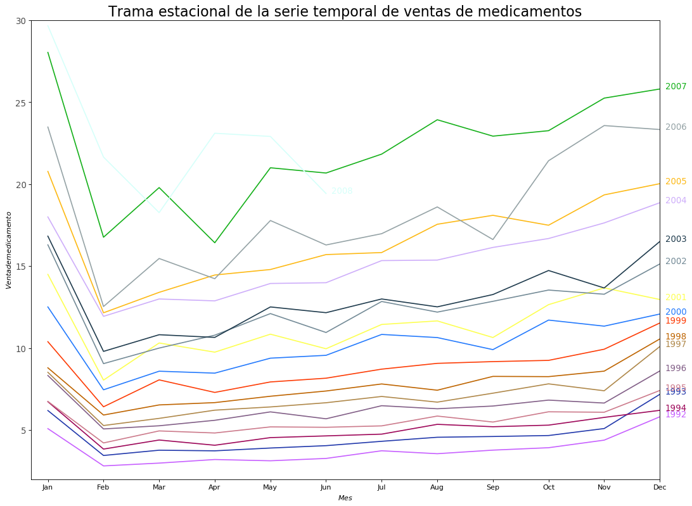
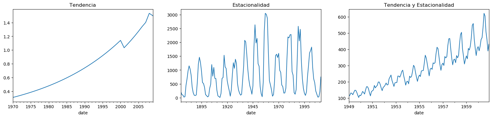

## ANÁLISIS DE SERIES DE TIEMPO
#### Integrantes:
##### -Raúl Salomón Almeraya Sibaja
##### -Karina Lizeth Ortiz Muñoz


En este ejemplo de Series de tiempo graficamos en python los casos confirmados por COVID-19 en México a partir del 11 de Marzo


```python
from dateutil.parser import parse 
from pandas.plotting import register_matplotlib_converters
import matplotlib as mpl
import matplotlib.pyplot as plt
import seaborn as sns
import numpy as np
import pandas as pd
plt.rcParams.update({'figure.figsize': (10, 7), 'figure.dpi': 120})

register_matplotlib_converters()

# Time series data source: fpp pacakge in R.
import matplotlib.pyplot as plt
df = pd.read_csv('https://raw.githubusercontent.com/raulsibaja7/MineriaDeDatos_RaulSibaja/master/PuntoExtra1/covid.csv', parse_dates=['date'], index_col='date')

# Draw Plot
def plot_df(df, x, y, title="", xlabel='Fecha', ylabel='Casos Confirmados', dpi=100):
    plt.figure(figsize=(16,5), dpi=dpi)
    plt.plot(x, y, color='tab:pink')
    plt.scatter(x,y)
    plt.gca().set(title=title, xlabel=xlabel, ylabel=ylabel)
    plt.show()

plot_df(df, x=df.index, y=df.value, title='Casos COVID-19 México 11 al 30 de marzo')
```


```python
# Import Data
df = pd.read_csv('https://raw.githubusercontent.com/selva86/datasets/master/a10.csv', parse_dates=['date'], index_col='date')
df.reset_index(inplace=True)

# Prepare data
df['year'] = [d.year for d in df.date]
df['month'] = [d.strftime('%b') for d in df.date]
years = df['year'].unique()

# Prep Colors
np.random.seed(100)
mycolors = np.random.choice(list(mpl.colors.XKCD_COLORS.keys()), len(years), replace=False)

# Draw Plot
plt.figure(figsize=(16,12), dpi= 80)
for i, y in enumerate(years):
    if i > 0:        
        plt.plot('month', 'value', data=df.loc[df.year==y, :], color=mycolors[i], label=y)
        plt.text(df.loc[df.year==y, :].shape[0]-.9, df.loc[df.year==y, 'value'][-1:].values[0], y, fontsize=12, color=mycolors[i])

# Decoration
plt.gca().set(xlim=(-0.3, 11), ylim=(2, 30), ylabel='$Venta de medicamento$', xlabel='$Mes$')
plt.yticks(fontsize=12, alpha=.7)
plt.title("Trama estacional de la serie temporal de ventas de medicamentos", fontsize=20)
plt.show()
```





```python
fig, axes = plt.subplots(1,3, figsize=(20,4), dpi=100)
pd.read_csv('https://raw.githubusercontent.com/selva86/datasets/master/guinearice.csv', parse_dates=['date'], index_col='date').plot(title='Tendencia', legend=False, ax=axes[0])

pd.read_csv('https://raw.githubusercontent.com/selva86/datasets/master/sunspotarea.csv', parse_dates=['date'], index_col='date').plot(title='Estacionalidad', legend=False, ax=axes[1])

pd.read_csv('https://raw.githubusercontent.com/selva86/datasets/master/AirPassengers.csv', parse_dates=['date'], index_col='date').plot(title='Tendencia y Estacionalidad', legend=False, ax=axes[2])
```


    <matplotlib.axes._subplots.AxesSubplot at 0x7fcef4d71fd0>





```python

```
