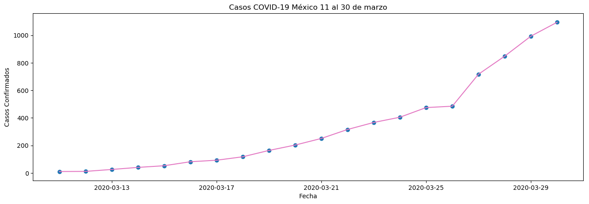

## ANÁLISIS DE SERIES DE TIEMPO
#### Integrantes:
##### -Raúl Salomón Almeraya Sibaja
##### -Karina Lizeth Ortiz Muñoz


En este ejemplo de Series de tiempo graficamos en python los casos confirmados por COVID-19 en México a partir del 11 de Marzo


```python
from dateutil.parser import parse 
from pandas.plotting import register_matplotlib_converters
import matplotlib as mpl
import matplotlib.pyplot as plt
import seaborn as sns
import numpy as np
import pandas as pd
plt.rcParams.update({'figure.figsize': (10, 7), 'figure.dpi': 120})

register_matplotlib_converters()

# Time series data source: fpp pacakge in R.
import matplotlib.pyplot as plt
df = pd.read_csv('https://raw.githubusercontent.com/raulsibaja7/MineriaDeDatos_RaulSibaja/master/PuntoExtra1/covid.csv', parse_dates=['date'], index_col='date')

# Draw Plot
def plot_df(df, x, y, title="", xlabel='Fecha', ylabel='Casos Confirmados', dpi=100):
    plt.figure(figsize=(16,5), dpi=dpi)
    plt.plot(x, y, color='tab:pink')
    plt.gca().set(title=title, xlabel=xlabel, ylabel=ylabel)
    plt.show()

plot_df(df, x=df.index, y=df.value, title='Casos COVID-19 México 11 al 30 de marzo')

```



