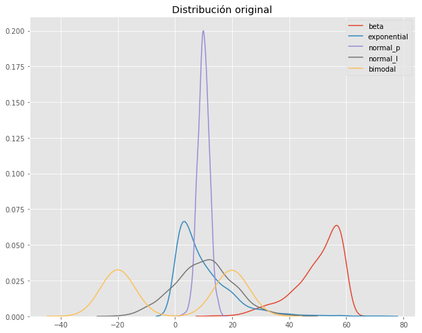
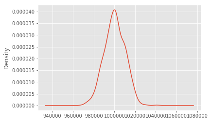
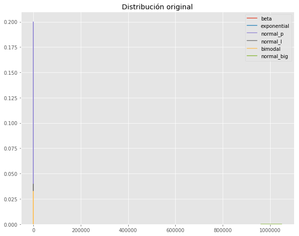
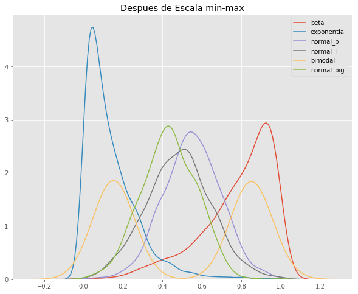
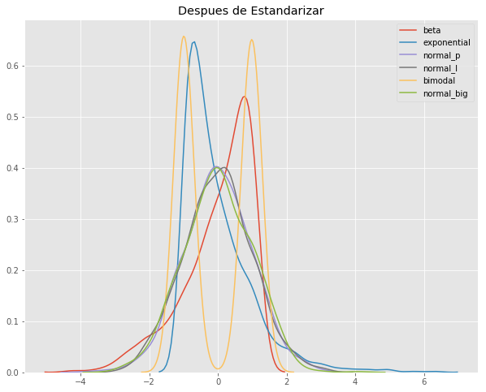
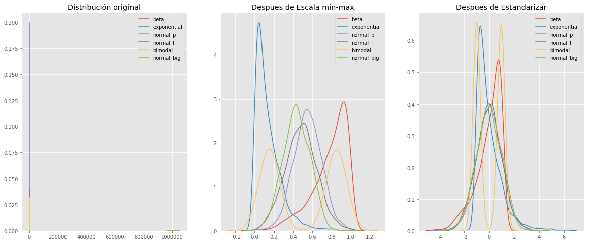

```python
import numpy as np 
import pandas as pd 
from sklearn import preprocessing

import matplotlib
import matplotlib.pyplot as plt
import seaborn as sns
import warnings

warnings.filterwarnings('ignore')

%matplotlib inline
matplotlib.style.use('ggplot')

np.random.seed(34)
```


```python
#crear columnas de varias distribuciones
df = pd.DataFrame({ 
    'beta': np.random.beta(5, 1, 1000) * 60,        # beta
    'exponential': np.random.exponential(10, 1000), # exponential
    'normal_p': np.random.normal(10, 2, 1000),      # normal platykurtic
    'normal_l': np.random.normal(10, 10, 1000),     # normal leptokurtic
})

# hacer distribución bimodal
first_half = np.random.normal(20, 3, 500) 
second_half = np.random.normal(-20, 3, 500) 
bimodal = np.concatenate([first_half, second_half])

df['bimodal'] = bimodal

# crea una lista de nombres de columna para usar más tarde
col_names = list(df.columns)
```


```python
# diagrama de distribución original
fig, (ax1) = plt.subplots(ncols=1, figsize=(10, 8))
ax1.set_title('Distribución original')

sns.kdeplot(df['beta'], ax=ax1)
sns.kdeplot(df['exponential'], ax=ax1)
sns.kdeplot(df['normal_p'], ax=ax1)
sns.kdeplot(df['normal_l'], ax=ax1)
sns.kdeplot(df['bimodal'], ax=ax1);
```





```python
df.head()
```


<div>
<style scoped>
    .dataframe tbody tr th:only-of-type {
        vertical-align: middle;
    }

    .dataframe tbody tr th {
        vertical-align: top;
    }

    .dataframe thead th {
        text-align: right;
    }
</style>
<table border="1" class="dataframe">
  <thead>
    <tr style="text-align: right;">
      <th></th>
      <th>beta</th>
      <th>exponential</th>
      <th>normal_p</th>
      <th>normal_l</th>
      <th>bimodal</th>
    </tr>
  </thead>
  <tbody>
    <tr>
      <th>0</th>
      <td>39.273740</td>
      <td>2.263890</td>
      <td>11.860245</td>
      <td>4.748207</td>
      <td>19.496627</td>
    </tr>
    <tr>
      <th>1</th>
      <td>55.030395</td>
      <td>13.108592</td>
      <td>11.796582</td>
      <td>10.959172</td>
      <td>16.871186</td>
    </tr>
    <tr>
      <th>2</th>
      <td>47.434682</td>
      <td>3.312019</td>
      <td>11.146945</td>
      <td>3.919227</td>
      <td>12.655741</td>
    </tr>
    <tr>
      <th>3</th>
      <td>43.173536</td>
      <td>17.664301</td>
      <td>8.266689</td>
      <td>42.072915</td>
      <td>18.657904</td>
    </tr>
    <tr>
      <th>4</th>
      <td>45.681443</td>
      <td>2.109760</td>
      <td>5.112983</td>
      <td>16.960664</td>
      <td>22.646439</td>
    </tr>
  </tbody>
</table>
</div>


```python
df.mean()
```


    beta           50.024249
    exponential    10.028387
    normal_p        9.994006
    normal_l       10.175745
    bimodal        -0.076622
    dtype: float64


```python
normal_big = np.random.normal(1000000, 10000, (1000,1))  # normal distribution of large values
df['normal_big'] = normal_big
```


```python
col_names.append('normal_big')
```


```python
df['normal_big'].plot(kind='kde')
```


    <matplotlib.axes._subplots.AxesSubplot at 0x7f87b0e679b0>





```python
df.normal_big.mean()
```


    1000258.722664037


```python
# diagrama de distribución original con función de valor mayor
fig, (ax1) = plt.subplots(ncols=1, figsize=(10, 8))
ax1.set_title('Distribución original')

sns.kdeplot(df['beta'], ax=ax1)
sns.kdeplot(df['exponential'], ax=ax1)
sns.kdeplot(df['normal_p'], ax=ax1)
sns.kdeplot(df['normal_l'], ax=ax1)
sns.kdeplot(df['bimodal'], ax=ax1);
sns.kdeplot(df['normal_big'], ax=ax1);
```





```python
# La nueva distribución de alto valor está a la derecha.
```


```python
df.describe()
```


<div>
<style scoped>
    .dataframe tbody tr th:only-of-type {
        vertical-align: middle;
    }

    .dataframe tbody tr th {
        vertical-align: top;
    }

    .dataframe thead th {
        text-align: right;
    }
</style>
<table border="1" class="dataframe">
  <thead>
    <tr style="text-align: right;">
      <th></th>
      <th>beta</th>
      <th>exponential</th>
      <th>normal_p</th>
      <th>normal_l</th>
      <th>bimodal</th>
      <th>normal_big</th>
    </tr>
  </thead>
  <tbody>
    <tr>
      <th>count</th>
      <td>1000.000000</td>
      <td>1000.000000</td>
      <td>1000.000000</td>
      <td>1000.000000</td>
      <td>1000.000000</td>
      <td>1.000000e+03</td>
    </tr>
    <tr>
      <th>mean</th>
      <td>50.024249</td>
      <td>10.028387</td>
      <td>9.994006</td>
      <td>10.175745</td>
      <td>-0.076622</td>
      <td>1.000259e+06</td>
    </tr>
    <tr>
      <th>std</th>
      <td>8.474545</td>
      <td>9.733928</td>
      <td>2.013971</td>
      <td>10.104004</td>
      <td>20.165208</td>
      <td>9.935564e+03</td>
    </tr>
    <tr>
      <th>min</th>
      <td>13.854022</td>
      <td>0.007617</td>
      <td>2.356844</td>
      <td>-19.539980</td>
      <td>-28.709856</td>
      <td>9.692079e+05</td>
    </tr>
    <tr>
      <th>25%</th>
      <td>45.793283</td>
      <td>2.951421</td>
      <td>8.687478</td>
      <td>3.566822</td>
      <td>-19.995311</td>
      <td>9.936191e+05</td>
    </tr>
    <tr>
      <th>50%</th>
      <td>52.337504</td>
      <td>7.018565</td>
      <td>9.983498</td>
      <td>10.326331</td>
      <td>0.237049</td>
      <td>1.000241e+06</td>
    </tr>
    <tr>
      <th>75%</th>
      <td>56.722191</td>
      <td>14.022485</td>
      <td>11.306914</td>
      <td>16.615057</td>
      <td>19.891202</td>
      <td>1.007335e+06</td>
    </tr>
    <tr>
      <th>max</th>
      <td>59.990640</td>
      <td>71.344341</td>
      <td>16.214364</td>
      <td>42.072915</td>
      <td>28.252151</td>
      <td>1.040677e+06</td>
    </tr>
  </tbody>
</table>
</div>


```python
#Escala min-max 
# Resta la media de la columna de cada valor y luego la divide por el rango.
mm_scaler = preprocessing.MinMaxScaler()
df_mm = mm_scaler.fit_transform(df)

df_mm = pd.DataFrame(df_mm, columns=col_names)

fig, (ax1) = plt.subplots(ncols=1, figsize=(10, 8))
ax1.set_title('Despues de Escala min-max')

sns.kdeplot(df_mm['beta'], ax=ax1)
sns.kdeplot(df_mm['exponential'], ax=ax1)
sns.kdeplot(df_mm['normal_p'], ax=ax1)
sns.kdeplot(df_mm['normal_l'], ax=ax1)
sns.kdeplot(df_mm['bimodal'], ax=ax1)
sns.kdeplot(df_mm['normal_big'], ax=ax1);
```





```python
# Observe cómo la forma de cada distribución permanece igual, pero ahora los valores están entre 0 y 1.
```


```python
#Estandarización
# Escala cada columna para que tenga 0 media y varianza unitaria.
s_scaler = preprocessing.StandardScaler()
df_s = s_scaler.fit_transform(df)

df_s = pd.DataFrame(df_s, columns=col_names)

fig, (ax1) = plt.subplots(ncols=1, figsize=(10, 8))
ax1.set_title('Despues de Estandarizar')

sns.kdeplot(df_s['beta'], ax=ax1)
sns.kdeplot(df_s['exponential'], ax=ax1)
sns.kdeplot(df_s['normal_p'], ax=ax1)
sns.kdeplot(df_s['normal_l'], ax=ax1)
sns.kdeplot(df_s['bimodal'], ax=ax1)
sns.kdeplot(df_s['normal_big'], ax=ax1);
```





```python
# Puede ver que todas las características ahora tienen 0 medias.
```


```python
# Combined plot.

fig, (ax0, ax1, ax2) = plt.subplots(ncols=3, figsize=(20, 8))


ax0.set_title('Distribución original')

sns.kdeplot(df['beta'], ax=ax0)
sns.kdeplot(df['exponential'], ax=ax0)
sns.kdeplot(df['normal_p'], ax=ax0)
sns.kdeplot(df['normal_l'], ax=ax0)
sns.kdeplot(df['bimodal'], ax=ax0)
sns.kdeplot(df['normal_big'], ax=ax0);


ax1.set_title('Despues de Escala min-max')

sns.kdeplot(df_mm['beta'], ax=ax1)
sns.kdeplot(df_mm['exponential'], ax=ax1)
sns.kdeplot(df_mm['normal_p'], ax=ax1)
sns.kdeplot(df_mm['normal_l'], ax=ax1)
sns.kdeplot(df_mm['bimodal'], ax=ax1)
sns.kdeplot(df_mm['normal_big'], ax=ax1);


ax2.set_title('Despues de Estandarizar')

sns.kdeplot(df_s['beta'], ax=ax2)
sns.kdeplot(df_s['exponential'], ax=ax2)
sns.kdeplot(df_s['normal_p'], ax=ax2)
sns.kdeplot(df_s['normal_l'], ax=ax2)
sns.kdeplot(df_s['bimodal'], ax=ax2)
sns.kdeplot(df_s['normal_big'], ax=ax2);
```




